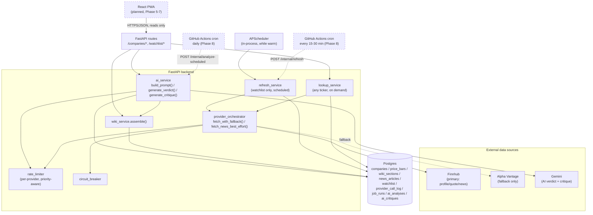

# Personal Investment Research App

A personal, single-user tool for deciding which stocks to buy, hold, or sell — backed by
always-fresh price/news data and an AI that reasons over a browsable, **wiki-style** company
page instead of raw numbers. Fully free-tier stack, no paid services anywhere.

Full design rationale lives in [`documentations/plan.md`](documentations/plan.md); the
structured, testable spec and task breakdown (source of truth for *what's done*) lives in
[`documentations/spec.md`](documentations/spec.md); per-phase test reports live in
[`documentations/tests/`](documentations/tests/README.md).

**Current status:** Phase 0 through Phase 4 complete (backend skeleton, wiki assembly,
watchlist + scheduler + reliability, AI verdict + second-opinion pipeline). Frontend not
started. See [`documentations/spec.md`](documentations/spec.md) §9 for the full task breakdown.

---

## What it does

- Look up **any company** on demand — not just a fixed watchlist — and get an
  encyclopedia-style page assembled from real price and profile data.
- Add specific tickers to a **watchlist** to get them continuously, automatically refreshed in
  the background (so free-tier API budgets aren't burned tracking every company that exists).
- Ask an AI (Gemini) for a real buy/hold/sell verdict with concrete price targets and a
  suggested hold period — reasoning over *exactly* the same data the wiki page shows, never
  data the user can't also see. Plus an on-demand adversarial "second opinion" critique pass,
  restricted to watchlist tickers as extra quota protection.
- (Planned, Phase 5-7) A full fintech-style chart set (candlesticks, indicators, fundamentals,
  news sentiment, peer comparison) in a mobile-first installable PWA.
- Never silently fails: every provider outage, rate limit, or AI quota exhaustion is degraded
  gracefully and surfaced, never hidden.

## How it works

Postgres is always the source of truth that the API/frontend reads from — no request path ever
blocks on a live external call. Only background jobs write external data in.



**The two-tier coverage model** is the key idea: *any* ticker can be looked up on demand (one
fetch, cached until stale, never added to the watchlist), but only tickers you explicitly
promote get a recurring background job. This is what keeps the app usable for exploring the
whole market while staying safely inside free-tier rate limits for the handful of tickers you
actually track.

**Reliability mechanics** (Phase 3): every external call goes through a fallback orchestrator
(Finnhub → Alpha Vantage), a per-provider rate limiter and circuit breaker (both computed from
an append-only `provider_call_log`, so state survives a process restart), and jittered-backoff
retries for transient errors. Every job outcome — success or failure — is recorded in
`job_runs`, so nothing fails silently. See
[`documentations/tests/phase-3.md`](documentations/tests/phase-3.md) for a real drill proving
this against a genuinely broken provider key.

**AI budget priority** (Phase 4): Gemini calls share the same rate-limiter machinery, with a
priority-aware twist — scheduled watchlist analyses get the full daily budget, on-demand
analyses are throttled at a smaller fraction of it, and the second-opinion critique pass (the
lowest priority, watchlist-only) at a smaller fraction still. Quota exhaustion always degrades
gracefully: a scheduled analysis just skips that ticker until next cycle, an on-demand request
gets a clear "try again later" (`429`), never a silent failure or a generic `500`.

## What it will look like

The frontend doesn't exist yet (Phase 5+), but the company wiki page — the core
differentiator — is speced out in detail in `plan.md`. Planned layout, top to bottom:

```
┌─────────────────────────────────────────────────────────┐
│ Infobox: name / ticker / logo / price / sector tags      │
│ Freshness indicator · Analyze with AI · Watchlist · Compare│
├─────────────────────────────────────────────────────────┤
│ 🟢 AI VERDICT BANNER  (buy/hold/sell, confidence,          │
│    price targets, hold period, cited sources,             │
│    "Get Second Opinion" button)     <- 2nd thing on page   │
├─────────────────────────────────────────────────────────┤
│ Price chart: candlesticks + volume, SMA/EMA/Bollinger,     │
│ RSI/MACD sub-panes, benchmark compare, verdict markers      │
├─────────────────────────────────────────────────────────┤
│ Overview (encyclopedia-style prose)                        │
│ Key Metrics (stat tiles)                                   │
│ Financials (bar charts: revenue/earnings/EPS/P-E)          │
│ Recent News (+ sentiment chart)                            │
│ AI Analysis History (full verdict timeline, expandable)    │
│ Risks / Notes                                              │
└─────────────────────────────────────────────────────────┘
```

Mobile-first, installable as a PWA (bottom tab bar on phone, nav rail on desktop), dark-mode
first, RSI/MACD panes collapse to an accordion on narrow screens. Full detail in
[`documentations/plan.md`](documentations/plan.md) → "Frontend (React + Vite PWA)".

Today, that same data is already reachable as JSON — `GET /companies/AAPL/wiki` returns the
`overview`/`key_metrics`/`financials_summary`/`news_digest`/`risks_notes` sections, price data,
and freshness timestamps that page will eventually render, and `POST
/companies/AAPL/analyze` already returns exactly the verdict/confidence/price-targets/
hold-period/cited-sources shape the AI verdict banner will show.

## Main commands

This project's local dev Postgres runs natively inside a WSL `Ubuntu` distro (a `docker-compose.yml`
is provided too, for machines where Docker's host↔container networking works — see the
"Local dev environment note" in `documentations/spec.md` Phase 1 for why this machine doesn't
use it).

```bash
# One-time setup (inside WSL Ubuntu)
python3 -m venv .venv-wsl
source .venv-wsl/bin/activate
pip install -r requirements.txt -r requirements-dev.txt

# Copy and fill in secrets (never commit .env)
cp .env.example .env
# FINNHUB_API_KEY=...        (required)
# ALPHA_VANTAGE_API_KEY=...  (optional -- fallback provider + news sentiment, get a free key
#                             at alphavantage.co/support/#api-key)
# GEMINI_API_KEY=...         (required for the AI verdict/critique pipeline)
# DATABASE_URL=...           (defaults to the WSL-native Postgres on port 5433)

# Apply database migrations
alembic upgrade head

# Run the test suite
pytest                       # or: python -m pytest -q

# Run the API locally
uvicorn app.main:app --host 127.0.0.1 --port 8000

# Try it
curl http://127.0.0.1:8000/health
curl http://127.0.0.1:8000/companies/AAPL/wiki
curl -X POST http://127.0.0.1:8000/watchlist/AAPL/promote
curl -X DELETE http://127.0.0.1:8000/watchlist/AAPL
curl -X POST http://127.0.0.1:8000/internal/refresh          # normally cron-triggered
curl -X POST http://127.0.0.1:8000/companies/AAPL/analyze     # on-demand AI verdict
curl -X POST http://127.0.0.1:8000/internal/analyze-scheduled # normally cron-triggered
curl -X POST "http://127.0.0.1:8000/companies/AAPL/critique?analysis_id=1"  # watchlist tickers only

# Create a new migration after changing app/db/models.py
alembic revision -m "describe the change"
```

Alternative Postgres via Docker (untested on this machine, see note above):

```bash
docker compose up -d
```

## Project layout

```
app/
  main.py, config.py        — FastAPI app (lifespan starts/stops the scheduler), settings
  db/                        — SQLAlchemy models + Alembic migrations
  api/routers/                — health, wiki, watchlist, refresh, analysis (analyze/critique)
  jobs/scheduler.py          — APScheduler, calls the same function as the cron-facing route
  services/                  — wiki_service, lookup_service, refresh_service, watchlist_service,
                                provider_orchestrator, rate_limiter, circuit_breaker, ingest_service,
                                technicals_service, ai_service
  providers/                 — Finnhub (primary) + Alpha Vantage (fallback) clients, Gemini client
tests/
  unit/                      — no network, no DB (respx-mocked HTTP, pure-function logic)
  integration/               — real Postgres, transaction-rolled-back per test
prompts/                     — Gemini prompt templates (versioned by filename, never edited in place)
scripts/                     — standalone Gemini prompt test harness (Phase 0 derisking)
documentations/
  plan.md                    — narrative design doc (architecture rationale, tradeoffs)
  spec.md                    — structured spec + task breakdown (source of truth for progress)
  tests/                     — per-phase test reports (this doc's sibling index)
```

## Deployment (planned, Phase 8)

Everything runs local-only today. The planned free-tier deployment topology (Neon Postgres +
Render backend + GitHub Actions cron heartbeat + a static-hosted frontend) is detailed in
`documentations/plan.md` → "Deployment Decision".
