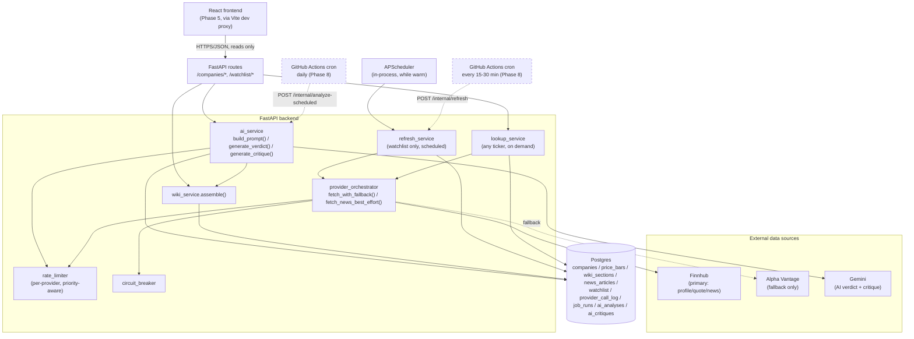

# Personal Investment Research App

A personal, single-user tool for deciding which stocks to buy, hold, or sell — backed by
always-fresh price/news data and an AI that reasons over a browsable, **wiki-style** company
page instead of raw numbers. Fully free-tier stack, no paid services anywhere.

Full design rationale lives in [`documentations/plan.md`](documentations/plan.md); the
structured, testable spec and task breakdown (source of truth for *what's done*) lives in
[`documentations/spec.md`](documentations/spec.md); per-phase test reports live in
[`documentations/tests/`](documentations/tests/README.md).

**Current status:** Phase 0 through Phase 5 functionally complete (backend skeleton, wiki
assembly, watchlist + scheduler + reliability, AI verdict + second-opinion pipeline, and a
working frontend core), plus four more features added before the planned design pass:
**stock categories**, **personal holdings tracking** (with AI position-awareness), a
**near-live intraday price chart**, and a **grounded AI chat** restricted to companies you
actually track. None of this frontend work has been **visually/interactively verified in a
real browser** (this session had no interactive Chrome available) — open it yourself before
trusting it beyond "it compiles and the API calls resolve." A dedicated visual design pass is
planned next, before the rest of Phase 6 (technical-indicator overlays, financials charts,
compare view). See [`documentations/spec.md`](documentations/spec.md) §9 for the full task
breakdown.

---

## What it does

- Look up **any company** on demand — not just a fixed watchlist — and get an
  encyclopedia-style page assembled from real price and profile data.
- Add specific tickers to a **watchlist** to get them continuously, automatically refreshed in
  the background (so free-tier API budgets aren't burned tracking every company that exists).
- Ask an AI (Gemini) for a real buy/hold/sell verdict with concrete price targets and a
  suggested hold period — reasoning over *exactly* the same data the wiki page shows, never
  data the user can't also see. Plus an on-demand adversarial "second opinion" critique pass,
  restricted to watchlist tickers as extra quota protection.
- A working frontend (dashboard, search, company wiki page, portfolio, chat) — functional but
  not yet visually designed; a dedicated design pass is next. (Planned, Phase 6-7) A full
  fintech-style chart set (technical-indicator overlays, fundamentals, news sentiment, peer
  comparison) and PWA install/offline support remain.
- Browse and filter tracked companies by **broad category** (Technology, Healthcare, Energy,
  etc.) — keyword-mapped from each company's sector, shown on the dashboard and the wiki page.
- Track your own **holdings** (shares + cost basis) per company — the AI verdict engine takes
  your actual position into account (e.g. whether a stop-loss sits above or below your cost
  basis) without ever letting it bias the verdict itself.
- A **near-live intraday price chart** on every company's wiki page — candlesticks built from
  real daily history plus a live-polled "right now" bar (Finnhub's free tier has no intraday
  candle endpoint, so this is aggregated from repeated `/quote` polls instead).
- **Chat with the AI** about your tracked companies — grounded strictly to what you're actually
  watchlisting, holding, or have looked up; it will tell you plainly (and suggest tickers you
  do track) rather than answer from general market knowledge if you ask about something outside
  that set.
- Never silently fails: every provider outage, rate limit, or AI quota exhaustion is degraded
  gracefully and surfaced, never hidden.
- Tracks its own verdicts against what price actually did 30 days later, and whether the AI's
  confidence score is actually calibrated (do high-confidence verdicts do better than
  low-confidence ones) — because a single LLM call reasoning over thin real-world data (no
  fundamentals ingested yet, news often unavailable depending on provider access) shouldn't be
  trusted just because it sounds sure. See "A note on trust" below.

## How it works

Postgres is always the source of truth that the API/frontend reads from — no request path ever
blocks on a live external call. Only background jobs write external data in.



**The two-tier coverage model** is the key idea: *any* ticker can be looked up on demand (one
fetch, cached until stale, never added to the watchlist), but only tickers you explicitly
promote get a recurring background job. This is what keeps the app usable for exploring the
whole market while staying safely inside free-tier rate limits for the handful of tickers you
actually track. Promoting a ticker also triggers a one-time historical price backfill (Alpha
Vantage, ~100 trading days in a single call) if it doesn't have enough history yet — so
swing-level/moving-average technicals are usable immediately instead of taking weeks to
accumulate one bar at a time. Deliberately not done on plain lookups, to protect Alpha
Vantage's small fallback-only budget from being spent on casual browsing.

**Reliability mechanics** (Phase 3): every external call goes through a fallback orchestrator
(Finnhub → Alpha Vantage), a per-provider rate limiter and circuit breaker (both computed from
an append-only `provider_call_log`, so state survives a process restart), and jittered-backoff
retries for transient errors. Every job outcome — success or failure — is recorded in
`job_runs`, so nothing fails silently. See
[`documentations/tests/phase-3.md`](documentations/tests/phase-3.md) for a real drill proving
this against a genuinely broken provider key.

**AI budget priority** (Phase 4): Gemini calls share the same rate-limiter machinery, with a
priority-aware twist — scheduled watchlist analyses get the full daily budget, on-demand
analyses are throttled at a smaller fraction of it, and the second-opinion critique pass (the
lowest priority, watchlist-only) at a smaller fraction still. Quota exhaustion always degrades
gracefully: a scheduled analysis just skips that ticker until next cycle, an on-demand request
gets a clear "try again later" (`429`), never a silent failure or a generic `500`.

## A note on trust

The engineering above is designed to never silently fail or fabricate confidence — but that's
a claim about the *plumbing*, not about whether you should act on any given verdict. Today's
verdicts reason over a real price snapshot plus whatever news happened to be available, with
no fundamentals ingested at all. Historical backfill (above) means most price-based technicals
are usable immediately for watchlist tickers now — but the 200-day moving average still needs
real elapsed time (Alpha Vantage's free tier only offers ~100 days of history), and there's
still no earnings/revenue/margin data of any kind feeding the AI. A low-confidence "hold" on
thin data isn't the app being unhelpful — it's the honest answer. `GET /verdicts/track-record` exists specifically to make that trustworthiness
checkable over time instead of assumed: does the AI's stated confidence actually predict
whether it's right. See [`documentations/spec.md`](documentations/spec.md) §12 for the fuller
discussion and [`documentations/tests/outcome-tracking.md`](documentations/tests/outcome-tracking.md)
for how it's tested.

## What it looks like

The frontend exists now (Phase 5) — dashboard, search, company wiki page, portfolio, and chat
all work functionally against the real backend — but it's using a plain, functional Tailwind
baseline, not a final visual design. A dedicated design pass is next. The company wiki page —
the core differentiator — is speced out in detail in `plan.md`; built so far, top to bottom
(technical-indicator overlays/benchmark-compare are the remaining Phase 6 scope):

```
┌─────────────────────────────────────────────────────────┐
│ Infobox: name / ticker / logo / price / sector / category │
│ Freshness indicator · Analyze with AI · Watchlist · Compare│
├─────────────────────────────────────────────────────────┤
│ 🟢 AI VERDICT BANNER  (buy/hold/sell, confidence,          │
│    price targets, hold period, cited sources,             │
│    "Get Second Opinion" button)     <- 2nd thing on page   │
├─────────────────────────────────────────────────────────┤
│ Price chart: candlesticks (real daily history + a live-    │
│ polled "right now" bar); SMA/EMA/Bollinger/RSI/MACD/       │
│ benchmark-compare are still Phase 6 scope                  │
├─────────────────────────────────────────────────────────┤
│ Your Position: shares · cost basis · unrealized gain/loss  │
│ (or "add a position" if you don't hold one)                │
├─────────────────────────────────────────────────────────┤
│ Overview (encyclopedia-style prose)                        │
│ Key Metrics (stat tiles)                                   │
│ Financials (bar charts: revenue/earnings/EPS/P-E)          │
│ Recent News (+ sentiment chart)                            │
│ AI Analysis History (full verdict timeline, expandable)    │
│ Risks / Notes                                              │
└─────────────────────────────────────────────────────────┘
```

Two more full pages exist alongside it: `/portfolio` (add/edit/remove holdings, totals) and
`/chat` (ask the AI about anything you're tracking — grounded, never a general market scan).

Mobile-first responsive shell (nav rail on desktop, bottom tab bar on mobile) is in place;
full PWA install/offline support is Phase 7. Full detail in
[`documentations/plan.md`](documentations/plan.md) → "Frontend (React + Vite PWA)".

`frontend/` is a Vite + React + TypeScript + Tailwind v4 app, talking to the backend through
Vite's dev proxy (no CORS setup needed locally). React Query owns all server state, with one
query key per resource so a slow section never blocks a fast one (FR-23). See
[`documentations/spec.md`](documentations/spec.md)'s Phase 5 section for exactly what was
verified (typecheck + lint + real data through the proxy) versus what still needs your own
eyes in a browser (actual rendering, routing, interactivity).

## Main commands

This project's local dev Postgres runs natively inside a WSL `Ubuntu` distro (a `docker-compose.yml`
is provided too, for machines where Docker's host↔container networking works — see the
"Local dev environment note" in `documentations/spec.md` Phase 1 for why this machine doesn't
use it).

```bash
# One-time setup (inside WSL Ubuntu)
python3 -m venv .venv-wsl
source .venv-wsl/bin/activate
pip install -r requirements.txt -r requirements-dev.txt

# Copy and fill in secrets (never commit .env)
cp .env.example .env
# FINNHUB_API_KEY=...        (required)
# ALPHA_VANTAGE_API_KEY=...  (optional -- fallback provider, news sentiment, and one-time
#                             historical price backfill on watchlist promote; get a free key
#                             at alphavantage.co/support/#api-key)
# GEMINI_API_KEY=...         (required for the AI verdict/critique pipeline)
# DATABASE_URL=...           (defaults to the WSL-native Postgres on port 5433)

# Apply database migrations
alembic upgrade head

# Run the test suite
pytest                       # or: python -m pytest -q

# Run the API locally
uvicorn app.main:app --host 127.0.0.1 --port 8000

# Try it
curl http://127.0.0.1:8000/health
curl http://127.0.0.1:8000/companies/AAPL/wiki
curl -X POST http://127.0.0.1:8000/watchlist/AAPL/promote
curl -X DELETE http://127.0.0.1:8000/watchlist/AAPL
curl -X POST http://127.0.0.1:8000/internal/refresh          # normally cron-triggered
curl -X POST http://127.0.0.1:8000/companies/AAPL/analyze     # on-demand AI verdict
curl -X POST http://127.0.0.1:8000/internal/analyze-scheduled # normally cron-triggered
curl -X POST "http://127.0.0.1:8000/companies/AAPL/critique?analysis_id=1"  # watchlist tickers only
curl -X POST http://127.0.0.1:8000/internal/evaluate-outcomes  # normally cron-triggered
curl http://127.0.0.1:8000/verdicts/track-record               # is the AI's confidence calibrated?
curl -X POST http://127.0.0.1:8000/holdings/AAPL -H "Content-Type: application/json" \
  -d '{"shares": 10, "cost_basis_per_share": 150.0}'            # add/edit a position
curl http://127.0.0.1:8000/holdings                             # list positions with gain/loss
curl http://127.0.0.1:8000/companies/AAPL/price-history?interval=1d
curl -X POST http://127.0.0.1:8000/companies/AAPL/live-quote     # one near-live price poll
curl -X POST http://127.0.0.1:8000/chat -H "Content-Type: application/json" \
  -d '{"message": "whats the best stock im tracking right now"}'  # grounded chat

# Create a new migration after changing app/db/models.py
alembic revision -m "describe the change"
```

Alternative Postgres via Docker (untested on this machine, see note above):

```bash
docker compose up -d
```

Frontend (run alongside the backend above — the Vite dev proxy forwards `/api/*` to it):

```bash
cd frontend
npm install
npm run dev              # serves http://localhost:5173
npx tsc -b --noEmit       # type-check
npx oxlint                # lint
```

## Project layout

```
app/
  main.py, config.py        — FastAPI app (lifespan starts/stops the scheduler), settings
  db/                        — SQLAlchemy models + Alembic migrations
  api/routers/                — health, wiki, watchlist, refresh, analysis (analyze/critique),
                                outcomes (evaluate-outcomes/track-record), holdings,
                                price_history (price-history/live-quote), chat
  jobs/scheduler.py          — APScheduler, calls the same functions as their cron-facing routes
  services/                  — wiki_service, lookup_service, refresh_service, watchlist_service,
                                provider_orchestrator, rate_limiter, circuit_breaker, ingest_service,
                                technicals_service, ai_service, outcome_service, sector_taxonomy,
                                holdings_service, live_price_service, chat_service
  providers/                 — Finnhub (primary) + Alpha Vantage (fallback) clients, Gemini client
tests/
  unit/                      — no network, no DB (respx-mocked HTTP, pure-function logic)
  integration/               — real Postgres, transaction-rolled-back per test
frontend/                    — Vite + React + TypeScript + Tailwind v4 (Phase 5)
  src/api/                    — fetch client, TS types, React Query hooks (one key per resource)
  src/auth/                   — shared-credential auth gate (client-side only for now)
  src/components/              — Layout, FreshnessIndicator, VerdictBadge, VerdictBanner, Skeleton,
                                PriceChart (lightweight-charts)
  src/routes/                  — LoginPage, DashboardPage, SearchPage, CompanyPage, PortfolioPage,
                                ChatPage
prompts/                     — Gemini prompt templates (versioned by filename, never edited in place)
scripts/                     — standalone Gemini prompt test harness (Phase 0 derisking)
documentations/
  plan.md                    — narrative design doc (architecture rationale, tradeoffs)
  spec.md                    — structured spec + task breakdown (source of truth for progress)
  tests/                     — per-phase test reports (this doc's sibling index)
```

## Deployment (planned, Phase 8)

Everything runs local-only today. The planned free-tier deployment topology (Neon Postgres +
Render backend + GitHub Actions cron heartbeat + a static-hosted frontend) is detailed in
`documentations/plan.md` → "Deployment Decision".
