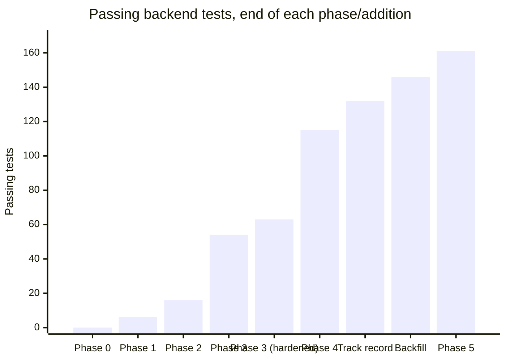
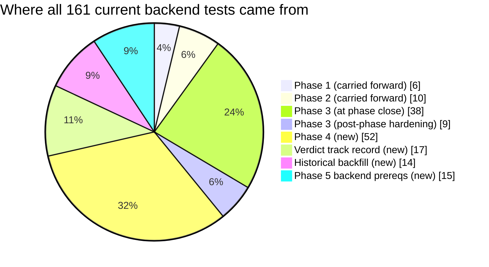

# Test Reports — Index

Per-phase test reports for the Personal Investment Research App, cross-referenced with
[`../spec.md`](../spec.md)'s task breakdown. Each phase's report lists what was tested, what
passed/failed, and — where applicable — what broke and how it got fixed.

| Phase | Report | Result |
|---|---|---|
| 0 — Derisk the AI prompt | [phase-0.md](phase-0.md) | 10/10 manual validation checks (no pytest suite yet) |
| 1 — Backend skeleton | [phase-1.md](phase-1.md) | 6/6 pytest |
| 2 — Wiki assembly + lookup tier | [phase-2.md](phase-2.md) | 16/16 pytest |
| 3 — Watchlist + scheduler + reliability | [phase-3.md](phase-3.md) | 63/63 pytest (54 at phase close + 9 from post-phase hardening) + live reliability drill + migration round-trip |
| 4 — AI pipeline (verdict + second opinion) | [phase-4.md](phase-4.md) | 115/115 pytest + live verification against the real Gemini API |
| Post-Phase-4 — Verdict track record | [outcome-tracking.md](outcome-tracking.md) | 132/132 pytest — found & fixed a real scheduler restart bug |
| Post-Phase-4 — Historical price backfill | [historical-backfill.md](historical-backfill.md) | 146/146 pytest + live verification with a real Alpha Vantage key |
| 5 — Frontend core | [phase-5.md](phase-5.md) | 161/161 backend pytest + frontend verified via typecheck/lint/proxy only — **no browser available this session** |

## Test count growth across phases

*(Phase 0 is 0 because it predates the pytest suite entirely — it was validated by hand, see
[phase-0.md](phase-0.md). "Phase 3 (hardened)" is the post-phase-close coverage audit — HTTP-level
router tests, a scheduler smoke test, and a migration downgrade/upgrade round-trip — done just
before starting Phase 4, see [phase-3.md](phase-3.md#post-phase-hardening-requested-before-starting-phase-4).
"Track record" and "Backfill" are standalone additions after Phase 4, not part of the original
phase numbering — see [outcome-tracking.md](outcome-tracking.md) and
[historical-backfill.md](historical-backfill.md) for why. "Phase 5" only counts backend tests —
the frontend has no automated test suite yet, see [phase-5.md](phase-5.md).)*

## Where all 161 current backend tests came from

## Overall pass rate

Every phase closed at **100% pass** before moving to the next — no phase's exit criterion was
ever declared met with a known-failing test:

| Phase | Tests | Pass rate at close |
|---|---|---|
| 0 | 10 validation checks | 100% |
| 1 | 6 | 100% |
| 2 | 16 | 100% |
| 3 | 63 (54 at close, +9 hardening) | 100% (after one same-session incident — see below) |
| 4 | 115 (+52) | 100% (after one same-session incident — see below) |
| Track record | 132 (+17) | 100% (one real bug found and fixed — see below) |
| Historical backfill | 146 (+14) | 100% (no product bugs; one real API-drift discovery — see below) |
| 5 (backend) | 161 (+15) | 100%; frontend not covered by pytest — see below |

Things worth calling out honestly, all self-diagnosed and resolved within the same session
they occurred:

- **Phase 3**: a live reliability drill against the shared dev database briefly broke 15 tests
  (a test-isolation bug — `rate_limiter`/`circuit_breaker` read every committed
  `provider_call_log` row, not just rows a test wrote itself) — 54 passed → 39 passed/15 failed
  → 54 passed again. Fixed by clearing that table inside each test's rolled-back transaction.
  Detail: [phase-3.md](phase-3.md#incident-a-real-bug-found-and-fixed-mid-phase).
- **Phase 4**: the live Gemini verification committed real `ai_analyses` rows, which broke two
  tests doing a *global* table count instead of scoping to their own seeded company — a bug in
  the tests, not the fixture this time. Fixed by scoping the assertions.
  Detail: [phase-4.md](phase-4.md#3-test-isolation-gap-on-ai_analyses-same-class-of-bug-as-phase-3-different-fix).
- **Track record**: adding a second scheduled job exposed a real, previously-latent bug —
  APScheduler's `BackgroundScheduler` can't be restarted after `shutdown()`, and the module held
  it as a permanent singleton. Never surfaced before because the real app only starts/stops the
  scheduler once per process. Fixed by rebuilding the scheduler instance on each `start()`.
  Detail: [outcome-tracking.md](outcome-tracking.md#bug-found-backgroundscheduler-cant-be-restarted-after-shutdown).
- **Historical backfill**: no product bug this time, but a real API-drift discovery caught by
  verifying live *before* building anything — Alpha Vantage's `outputsize=full` (full
  multi-year history) turned out to be premium-gated now, changing the design before a line of
  code was written. Detail: [historical-backfill.md](historical-backfill.md#verified-live-before-building-per-this-projects-established-habit).
- **Phase 5**: not a bug — a genuine verification gap, stated plainly rather than glossed over.
  This session has no interactive Chrome attached, so the frontend was verified via
  TypeScript compilation, linting, and HTTP-level proxy checks confirming every API call
  resolves against real backend data — but actual rendering, routing, and interactivity were
  **not** checked. Detail: [phase-5.md](phase-5.md#honest-limitation-no-browser-was-available).

**Back to:** [project README](../../README.md) · [plan.md](../plan.md) · [spec.md](../spec.md)
