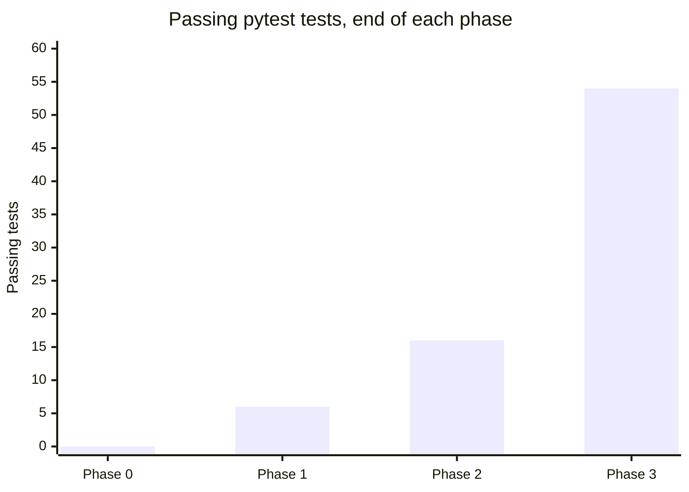
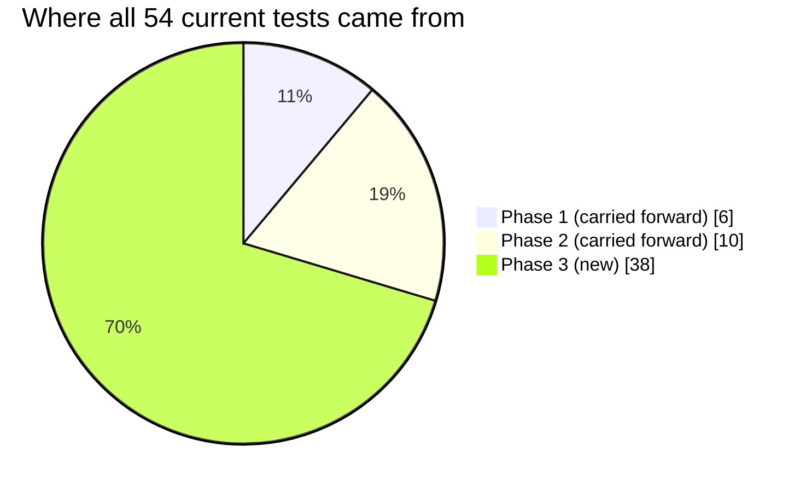

# Test Reports — Index

Per-phase test reports for the Personal Investment Research App, cross-referenced with
[`../spec.md`](../spec.md)'s task breakdown. Each phase's report lists what was tested, what
passed/failed, and — where applicable — what broke and how it got fixed.

| Phase | Report | Result |
|---|---|---|
| 0 — Derisk the AI prompt | [phase-0.md](phase-0.md) | 10/10 manual validation checks (no pytest suite yet) |
| 1 — Backend skeleton | [phase-1.md](phase-1.md) | 6/6 pytest |
| 2 — Wiki assembly + lookup tier | [phase-2.md](phase-2.md) | 16/16 pytest |
| 3 — Watchlist + scheduler + reliability | [phase-3.md](phase-3.md) | 54/54 pytest + live reliability drill |

## Test count growth across phases

*(Phase 0 is 0 because it predates the pytest suite entirely — it was validated by hand, see
[phase-0.md](phase-0.md).)*

## Where new tests came from, by phase

## Overall pass rate

Every phase closed at **100% pass** before moving to the next — no phase's exit criterion was
ever declared met with a known-failing test:

| Phase | Tests | Pass rate at phase close |
|---|---|---|
| 0 | 10 validation checks | 100% |
| 1 | 6 | 100% |
| 2 | 16 | 100% |
| 3 | 54 | 100% (after one same-session incident — see below) |

The one exception worth calling out honestly: mid-Phase-3, a live reliability drill against the
shared dev database briefly broke 15 tests (a test-isolation bug, not a product bug) before
being diagnosed and fixed within the same session — suite went 54 passed → 39 passed/15 failed
→ 54 passed again. Full detail in
[phase-3.md](phase-3.md#incident-a-real-bug-found-and-fixed-mid-phase).

**Back to:** [project README](../../README.md) · [plan.md](../plan.md) · [spec.md](../spec.md)
