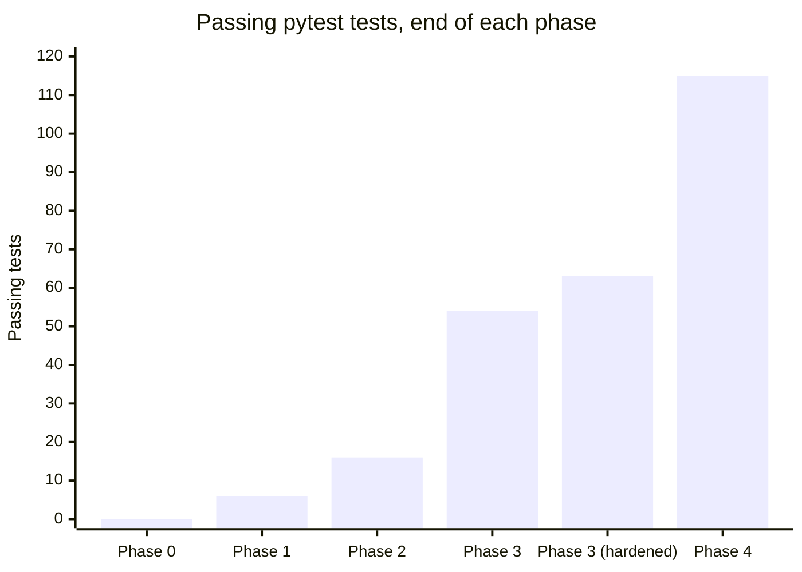
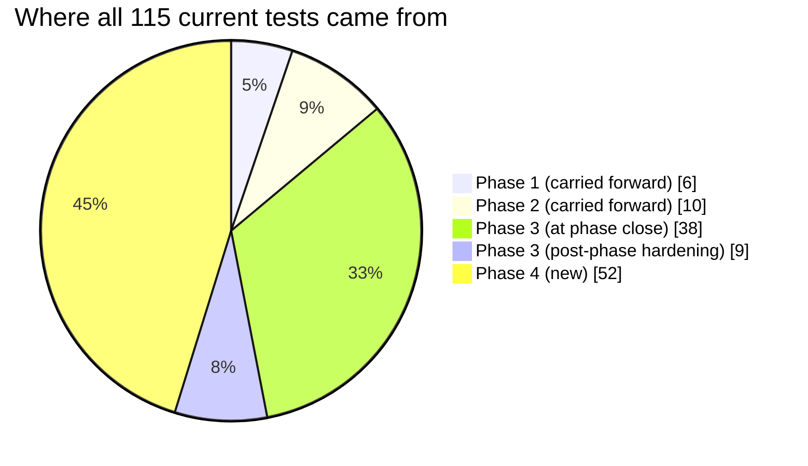

# Test Reports — Index

Per-phase test reports for the Personal Investment Research App, cross-referenced with
[`../spec.md`](../spec.md)'s task breakdown. Each phase's report lists what was tested, what
passed/failed, and — where applicable — what broke and how it got fixed.

| Phase | Report | Result |
|---|---|---|
| 0 — Derisk the AI prompt | [phase-0.md](phase-0.md) | 10/10 manual validation checks (no pytest suite yet) |
| 1 — Backend skeleton | [phase-1.md](phase-1.md) | 6/6 pytest |
| 2 — Wiki assembly + lookup tier | [phase-2.md](phase-2.md) | 16/16 pytest |
| 3 — Watchlist + scheduler + reliability | [phase-3.md](phase-3.md) | 63/63 pytest (54 at phase close + 9 from post-phase hardening) + live reliability drill + migration round-trip |
| 4 — AI pipeline (verdict + second opinion) | [phase-4.md](phase-4.md) | 115/115 pytest + live verification against the real Gemini API |

## Test count growth across phases

*(Phase 0 is 0 because it predates the pytest suite entirely — it was validated by hand, see
[phase-0.md](phase-0.md). "Phase 3 (hardened)" is the post-phase-close coverage audit — HTTP-level
router tests, a scheduler smoke test, and a migration downgrade/upgrade round-trip — done just
before starting Phase 4, see [phase-3.md](phase-3.md#post-phase-hardening-requested-before-starting-phase-4).)*

## Where all 115 current tests came from

## Overall pass rate

Every phase closed at **100% pass** before moving to the next — no phase's exit criterion was
ever declared met with a known-failing test:

| Phase | Tests | Pass rate at phase close |
|---|---|---|
| 0 | 10 validation checks | 100% |
| 1 | 6 | 100% |
| 2 | 16 | 100% |
| 3 | 63 (54 at close, +9 hardening) | 100% (after one same-session incident — see below) |
| 4 | 115 (+52) | 100% (after one same-session incident — see below) |

Two exceptions worth calling out honestly, both self-diagnosed and fixed within the same
session they occurred:

- **Phase 3**: a live reliability drill against the shared dev database briefly broke 15 tests
  (a test-isolation bug — `rate_limiter`/`circuit_breaker` read every committed
  `provider_call_log` row, not just rows a test wrote itself) — 54 passed → 39 passed/15 failed
  → 54 passed again. Fixed by clearing that table inside each test's rolled-back transaction.
  Detail: [phase-3.md](phase-3.md#incident-a-real-bug-found-and-fixed-mid-phase).
- **Phase 4**: the live Gemini verification committed real `ai_analyses` rows, which broke two
  tests doing a *global* table count instead of scoping to their own seeded company — a bug in
  the tests, not the fixture this time. Fixed by scoping the assertions.
  Detail: [phase-4.md](phase-4.md#3-test-isolation-gap-on-ai_analyses-same-class-of-bug-as-phase-3-different-fix).

**Back to:** [project README](../../README.md) · [plan.md](../plan.md) · [spec.md](../spec.md)
