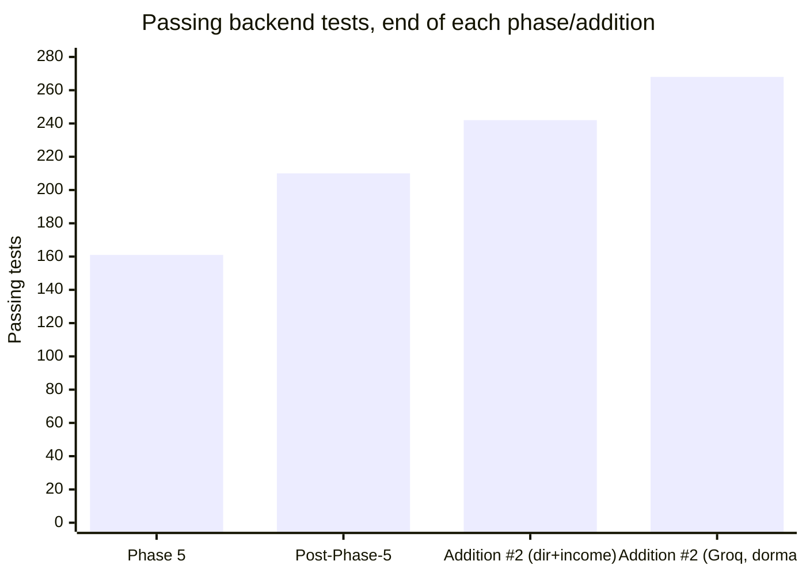

# Post-Phase-5 Addition #2 — Multi-Horizon Forecast (Second LLM / Groq): Test Report

**Scope:** the third and final sub-feature of Post-Phase-5 Addition #2, built **dormant** —
no Groq API key is obtainable as of 2026-08-05, so the whole feature ships switched off behind
a missing `GROQ_API_KEY` and must be a complete non-event until one is dropped in (spec.md
NFR-9 / FR-33a). The other two sub-features (ticker directory, income projection) shipped
earlier; this closes Addition #2.

**Backend result:** **268 / 268 pytest passed, 0 failed** (up from 242 at the start of this
session — **+26** new tests across the Groq client, forecast service, and forecast/status
routers). The full suite was run with `GROQ_API_KEY` **unset** — the standby's central
assertion — and stays green.
**Migrations:** all 12 round-trip. `alembic upgrade head → downgrade base → upgrade head` is
clean with the two new migrations (`0011` groq enum, `0012` price_forecasts).
**Frontend:** `tsc -b` + `vite build` clean; `oxlint` 0 errors (only the 2 known pre-existing
`AuthContext.tsx` fast-refresh warnings). **No interactive browser this session** — same
standing caveat as Phase 5 / Addition #1: the forecast panel's rendering and its disabled
standby state are confirmed by type-check + build, not by clicking.

## What was built

A second, fully independent free-tier LLM (**Groq**, Llama free tier) producing an **expected
low/high price band at each of 30 / 60 / 90 / 180 / 360 days** for a watchlist ticker — a
deeper, independently-reasoned second read alongside Gemini's single buy/hold/sell verdict, on
a wholly separate provider and quota so it can never starve the verdict/critique budget.

- **Config / `.env.example`** — `groq_api_key: str | None = None` plus `groq_model`
  (`llama-3.3-70b-versatile`, picked from docs and flagged for re-check at activation) and its
  own `groq_rate_limit_*` window. Same optional-key shape the other three providers use.
- **`ProviderName.groq` + migration `0011`** — `ALTER TYPE providername ADD VALUE IF NOT EXISTS
  'groq'`, copied verbatim from `0006`'s `gemini` pattern. Shipped *before* the client, because
  this is the exact bug Phase 4 hit (Python enum member added, `ALTER TYPE` forgotten, first
  rate-limiter check died). Both halves ship together.
- **`price_forecasts` table + migration `0012`** — append-only, one row per horizon per
  generation, per-horizon `confidence`, `model` stamped per row for audit.
- **`providers/groq_client.py`** — Groq's OpenAI-compatible `/chat/completions` in JSON-object
  mode, via plain `httpx` (no new dependency). Same Transient/Permanent error taxonomy as every
  other client. `is_available(key)` lets callers short-circuit on a missing key **before** any
  network work.
- **`prompts/forecast_prompt_v1.md`** — schema-forced JSON, all five horizons in one call,
  per-horizon confidence that must decay with horizon length. **UNVALIDATED** — written without
  the live derisk run every other prompt in this project got first (no key), so it's an
  assumption until `scripts/test_groq_prompt.py` is run at activation (FR-33b).
- **`services/forecast_service.py`** — reuses `ai_service`'s template helpers against the
  shared `wiki_service.assemble()` data (same traceability guarantee: Groq never reasons over
  data the user can't see). Validates the parsed response into exactly the five expected
  horizons (missing horizon, `high < low`, malformed field → `PermanentProviderError` → clear
  502, never a 500). Dormant-first: raises `ForecastUnavailableError` before any limiter /
  network / DB work when the key is absent.
- **Routers** — `POST /companies/{ticker}/forecast` (watchlist-only, on-demand-only, mirroring
  `/critique`; **key-absent 503 checked first**, before the watchlist check, so the message
  names the real blocker); `GET /companies/{ticker}/forecasts` (works with no key — empty
  structure); `GET /status` exposing `features.forecast` derived purely from key presence.
- **`scripts/test_groq_prompt.py`** — the deferred derisk script, mirroring
  `test_gemini_prompt.py`, written now so activation is one command. Confirmed it fills the
  prompt template from the real fixtures and exits cleanly on a missing key.
- **Frontend** — `ForecastPanel` on the company wiki page: a single-series horizontal
  range-band (dataviz form for magnitude/range) across the five horizons, one hue, direct
  low/high labels, per-horizon confidence. The "Generate Forecast" button is **disabled with a
  "Groq API key not configured" tooltip** while dormant (visibly on standby, not hidden), and
  the panel shows an explicit "on standby / not configured" empty state, never a spinner or
  blank box.

## The standby is asserted, not assumed (the addition's real exit criterion)

The whole point of the dormant build is that a missing key changes nothing. That is proven, not
hoped:

- **`test_generate_forecast_dormant_without_key_is_a_non_event`** — with `groq_api_key=None`,
  `generate_forecast` raises `ForecastUnavailableError` and writes **no** `price_forecasts`,
  **no** `provider_call_log`, and **no** `job_runs` row (delta-checked, not absolute).
- **`test_forecast_without_key_returns_503_and_writes_nothing`** — the HTTP path returns `503`
  with a "not configured" message and, again, writes nothing.
- **`test_forecast_key_absent_checked_before_watchlist_tier`** — a *lookup-tier* ticker with no
  key still gets `503` (the key blocker), not `400` (the tier error) — the message names the
  real cause.
- **`test_status_features_forecast_false_without_key` / `_true_with_key`** — the capability flag
  flips purely on key presence, so the frontend disables/enables with no code change. This is
  the activation acceptance test: dropping a key flips `features.forecast` to `true` and the
  button enables itself.
- **The full suite (268) runs green with `GROQ_API_KEY` unset**, and all 12 migrations
  round-trip — startup, routes, scheduler, tests, and migrations are all unaffected by the
  absent key.

The "with a key" paths are covered with a **mocked** Groq client (like every other provider's
parser tests, since no live key exists): five rows persisted in ascending horizon order, success
logged to `provider_call_log`, provider errors propagated with a failure logged, quota
exhaustion raised before any call, and the response-shape validation branches
(missing-horizon, `high < low`).

## Honest limitations carried forward

- **The prompt and response parsing are unvalidated** — no Groq key was obtainable, so unlike
  every other integration in this project the forecast prompt was written without a live derisk
  run. Expect the first real call to need prompt/parsing adjustment. This is tracked as the
  **"Groq activation"** checklist in spec.md §9 (re-check `groq_model` against Groq's live
  free-tier lineup, run `scripts/test_groq_prompt.py`, confirm bands widen and confidence
  decays, live end-to-end, flip the status flag). Activation is **not** part of this addition's
  completion and does **not** block Phase 6.
- **No interactive browser this session** — the panel's rendering and its disabled standby
  state are confirmed by type-check + build only, same caveat as Phase 5 / Addition #1.

## Environment note

The dev Postgres this suite runs against had drifted from what `.env` declares (the Docker
instance that previously served `trader:trader@localhost:5433` was down; a native PG-17 held the
port with no `trader` role). The role + database were recreated exactly as `.env` declares and
the schema rebuilt via `alembic upgrade head` — a disposable dev DB (every test rolls back), no
real trader data existed on that instance to affect.

## Migration numbering note

Addition #4 (chat citations) had *pencilled in* migration `0011`; since the Groq work shipped
first it took `0011`/`0012`, so Addition #4's column becomes `0013` when it's built — same
"whoever ships first takes the number" rule that gave the ticker directory `0010`.

**Previous:** [post-phase-5-additions.md](post-phase-5-additions.md) · **Back to index:**
[README.md](README.md)
