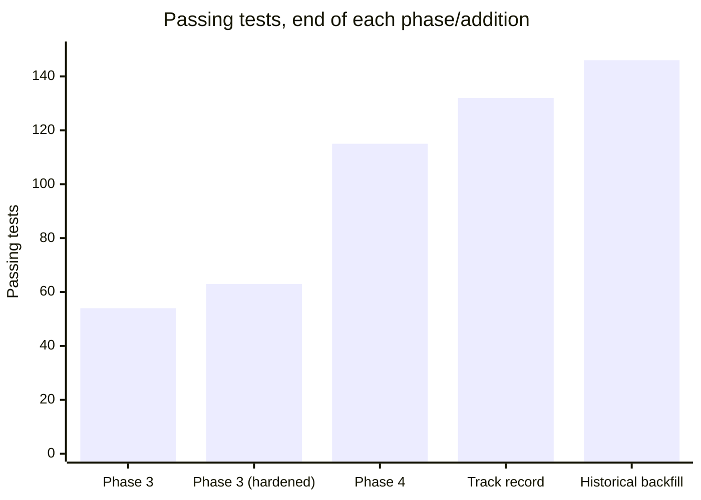
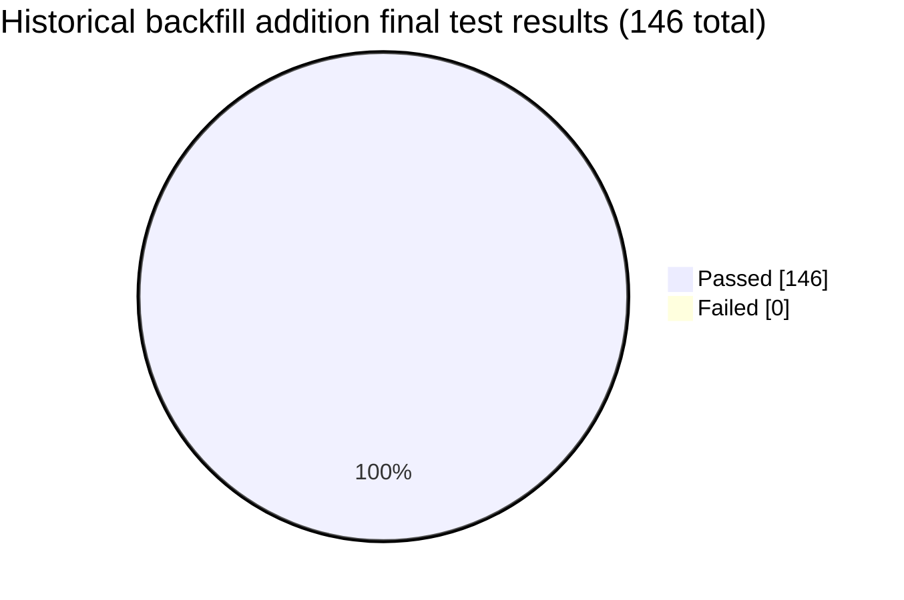
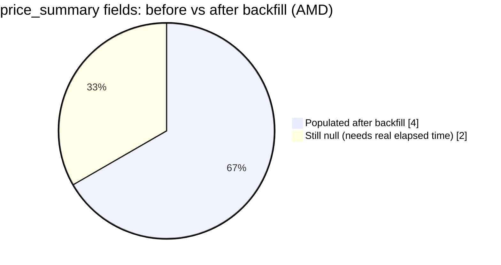

# Post-Phase-4 Addition — Historical Price Backfill: Test Report

**Addition:** One-time historical price backfill on watchlist promote (`AlphaVantageClient
.get_daily_history()`, `ingest_service.bulk_upsert_bars()`,
`provider_orchestrator.backfill_price_history()`, wired into `watchlist_service.promote()`)
**Why:** user-proposed after getting a real Alpha Vantage key — the other half of "verdicts
are stuck thin": swing-level/moving-average technicals were `null` until real time accumulated
one `price_bars` row per day. A one-time backfill closes most of that gap immediately instead
of over weeks.
**Result:** **146 / 146 passed, 0 failed** (up from 132 — 14 new tests). No product bugs found
this round; one real API-drift discovery caught by verifying live before building.

## Verified live before building (per this project's established habit)

Before writing any implementation, `TIME_SERIES_DAILY?outputsize=full` was called against the
real free-tier key. Result:

```json
{"Information": "Thank you for using Alpha Vantage! The outputsize=full parameter value is a
premium feature for the TIME_SERIES_DAILY endpoint..."}
```

**Full multi-year history is premium-gated now** — only `outputsize=compact` (~100 most recent
trading days) is free. This changed the plan before a line of implementation code was written:
20d/60d swing levels, 1d/1m/3m price change, and the 50-day moving average are all covered by
100 days; the 200-day moving average still needs real elapsed time regardless, same as before.

## Test count build-up

| Addition | Tests | File |
|---|---|---|
| `AlphaVantageClient.get_daily_history()` | +3 | `tests/unit/test_alpha_vantage_client.py` (11 → 14) |
| `ingest_service.bar_count()`/`bulk_upsert_bars()` | +4 (new file) | `tests/integration/test_ingest_service.py` |
| `provider_orchestrator.backfill_price_history()` | +5 | `tests/integration/test_provider_orchestrator.py` (10 → 15) |
| `watchlist_service.promote()` wiring (backfill + skip-if-sufficient) | +2 | `tests/integration/test_watchlist_service.py` (6 → 8) |

3 + 4 + 5 + 2 = **14 new tests**, 132 → 146.





## Design choices worth flagging

- **No fallback partner.** Unlike every other capability in `provider_orchestrator.py`,
  `backfill_price_history()` only ever calls Alpha Vantage — Finnhub has no free-tier
  historical-candles endpoint, so there's nothing to fall back *to*. It's still rate-limited
  and circuit-broken like everything else; it just doesn't iterate a provider list.
- **Scoped to `promote()`, not `lookup_service.get_or_fetch()`.** Alpha Vantage's daily budget
  (~25 free calls/day) is deliberately reserved as an emergency fallback, never a load-shared
  partner (a hard constraint since Phase 3). Backfilling on every casual lookup would risk
  draining that budget on low-stakes browsing; promoting a ticker is a deliberate,
  low-frequency action, so it's the safe hook point.
- **Idempotent by bar count, not by a separate "already backfilled" flag.** Checking
  `ingest_service.bar_count() >= backfill_min_bars_threshold` (50) before spending a call means
  re-promoting a previously-tracked ticker — which already has plenty of history from ongoing
  refreshes — costs nothing, without needing a dedicated tracking column.

## Live verification

Promoted AMD (previously untracked) with the real Alpha Vantage key:

| Check | Result |
|---|---|
| `backfilled: true` in the promote response | ✅ |
| Real historical bars landed | ✅ 101 bars, 2026-03-10 → 2026-08-03 — matches compact's ~100-day window exactly |
| `price_summary` populated with real numbers instead of null | ✅ `change_1m_pct: -8.15`, `change_3m_pct: 31.92`, `vs_50d_ma_pct: -7.24` |
| `recent_swing_levels` populated with real ranges | ✅ `high_20d: 574.2`, `low_20d: 424.03`, `high_60d: 584.73`, `low_60d: 393.36` |
| `vs_200d_ma_pct` still null (expected — needs real elapsed time, not backfillable on free tier) | ✅ Matches the plan's stated limitation |
| No crash, no silent failure | ✅ |



Bonus finding, reconfirming a Phase 4 discovery on a second real ticker: Finnhub's free tier
rejected AMD's `/company-news` call too (logged as a real `failure` in `provider_call_log`),
and the fallback to Alpha Vantage's `NEWS_SENTIMENT` kicked in correctly, returning real
sentiment-classified articles — better data than Finnhub would have given anyway, exactly the
value the fallback design was built for.

Cleaned up afterward (removed AMD from the watchlist, matching the established drill-cleanup
pattern); re-ran the full suite twice consecutively post-verification to confirm the earlier
`provider_call_log`-clearing fixture (from the Phase 3 incident) still protects against real
data written during live testing — both runs 146/146, no regression.

**Previous:** [outcome-tracking.md](outcome-tracking.md) · **Back to index:** [README.md](README.md)
