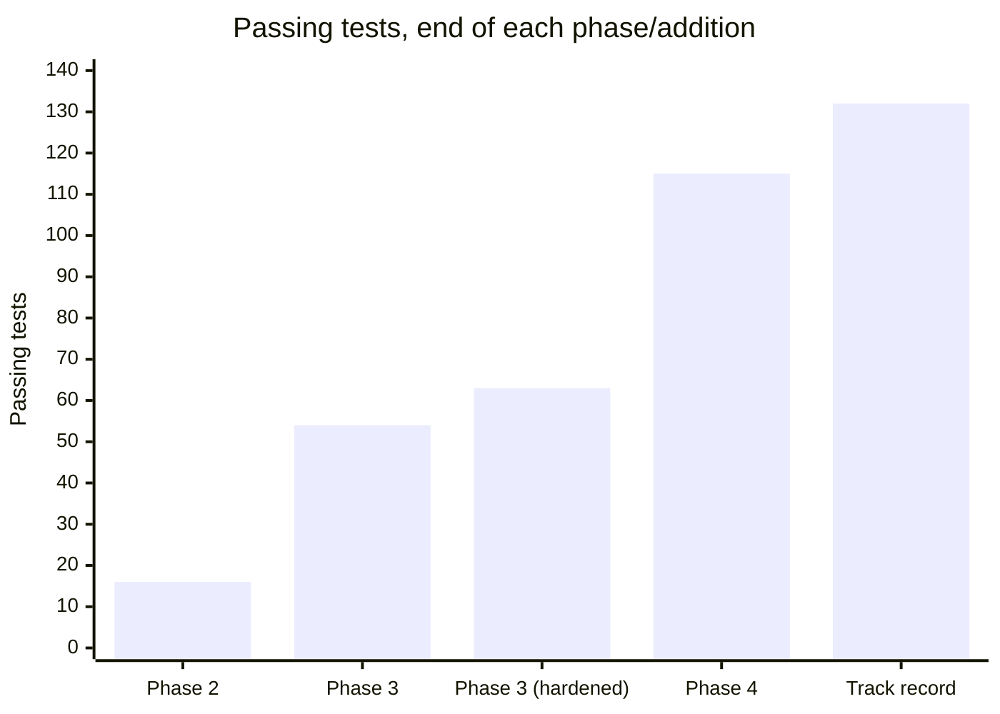
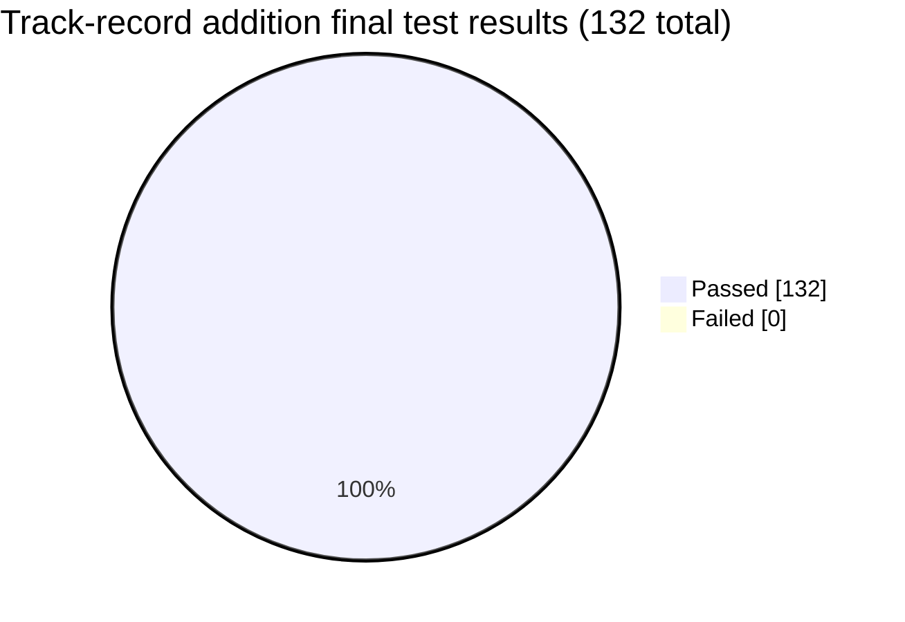
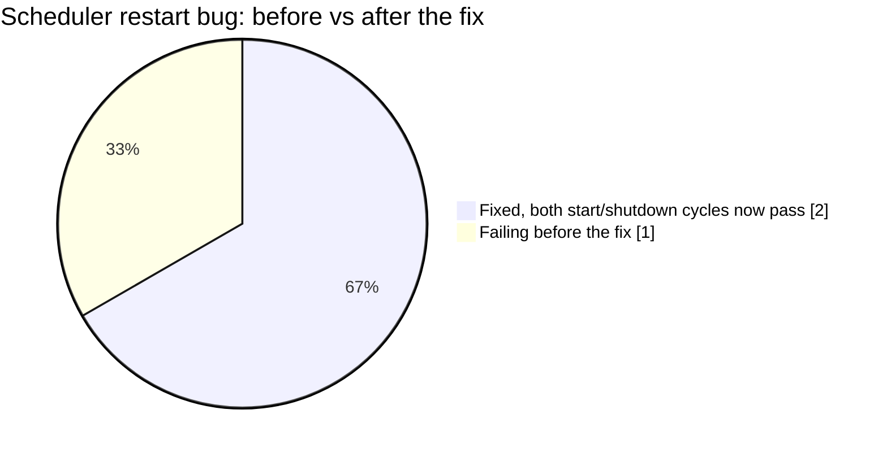

# Post-Phase-4 Addition — Verdict Track Record: Test Report

**Addition:** Verdict track record (`verdict_outcomes`, `outcome_service`, `POST
/internal/evaluate-outcomes`, `GET /verdicts/track-record`)
**Why:** raised directly after Phase 4's live verification — the engineering around the AI
pipeline is sound, but the actual investment judgment is unproven (no fundamentals, thin news,
technicals need weeks of real history, no backtesting). This turns "the AI feels confident"
into something checkable: did price actually move the way each verdict implied.
**Result:** **132 / 132 passed, 0 failed** (up from 115 at the end of Phase 4 — 17 new tests).
**Also found:** one real, previously-latent scheduler bug.

## What was tested

| File | Tests | What it covers |
|---|---|---|
| `tests/unit/test_outcome_service.py` | 8 | Directional-correctness logic (buy/sell/hold), snapshotted-price extraction |
| `tests/integration/test_outcome_service.py` | 5 | Full evaluation batch against real Postgres — evaluates past-horizon analyses, skips too-recent ones, skips ones with no price data yet, never re-evaluates, records `job_runs` |
| `tests/integration/test_outcomes_router.py` | 3 | HTTP-level: summary shape, empty track record, track record reflecting real evaluated outcomes |
| `tests/integration/test_scheduler.py` | +1 | The new `evaluate_outcomes` scheduler job actually fires on an interval |

8 + 5 + 3 + 1 = **17 new tests**, 115 → 132.





## Design choices worth flagging

- **Reuses the snapshotted price, doesn't re-derive it.** `price_at_verdict` comes straight
  from `ai_analyses.context_snapshot["prompt_data"]["price_summary"]["last_close"]` — the exact
  number the AI actually saw — rather than re-querying `price_bars` for "the price around that
  time," which could drift from what was actually reasoned over. This is a direct consequence
  of Phase 4's reproducibility design (NFR-5) paying off somewhere unplanned.
- **Skips, never fails, on missing horizon data.** An analysis with no `price_bars` row yet at
  the 30-day mark just isn't evaluated this cycle — retried automatically next time, same
  "never crash the batch over one bad lookup" philosophy as every other scheduled job in this
  project.
- **`hold`'s correctness band (±5%) is a judgment call**, not a industry-standard number —
  documented as a config knob (`verdict_outcome_hold_band_pct`) rather than hardcoded, since
  it's genuinely arguable what "hold was right" should mean.

## Bug found: `BackgroundScheduler` can't be restarted after `shutdown()`

Adding a second scheduled job (`evaluate_outcomes`) alongside the existing `refresh_watchlist`
job meant running two independent scheduler start/shutdown test cycles in the same test
session for the first time. The second one failed:

```
RuntimeError: cannot schedule new futures after shutdown
```

**Root cause:** `app/jobs/scheduler.py` held `_scheduler` as a single module-level
`BackgroundScheduler()` instance created once at import time. APScheduler's
`BackgroundScheduler` can't reuse its internal thread-pool executor after `shutdown()` is
called — a second `start()` on the same instance silently produces a scheduler that logs an
error on every tick and never actually runs anything. This was a **real, latent bug since
Phase 3** — it just never surfaced, because the real app only ever calls `start()` once per
process lifetime (at FastAPI startup) and `shutdown()` once (at process exit). Nothing before
this addition ever exercised a second start/shutdown cycle in the same process.

**Fix:** `start()` now builds a fresh `BackgroundScheduler()` instance each time it's called
(unless one is already running), rather than reusing a permanent module-level singleton. Cheap
to construct, and makes the module correctly restartable — which matters in the (currently
theoretical, but not impossible) case of the FastAPI lifespan running more than once in the
same process, e.g. certain reload/test-harness scenarios.



Re-ran both scheduler tests together, then the full suite twice consecutively, after the fix —
all green both times.

**Previous:** [phase-4.md](phase-4.md) · **Back to index:** [README.md](README.md)
