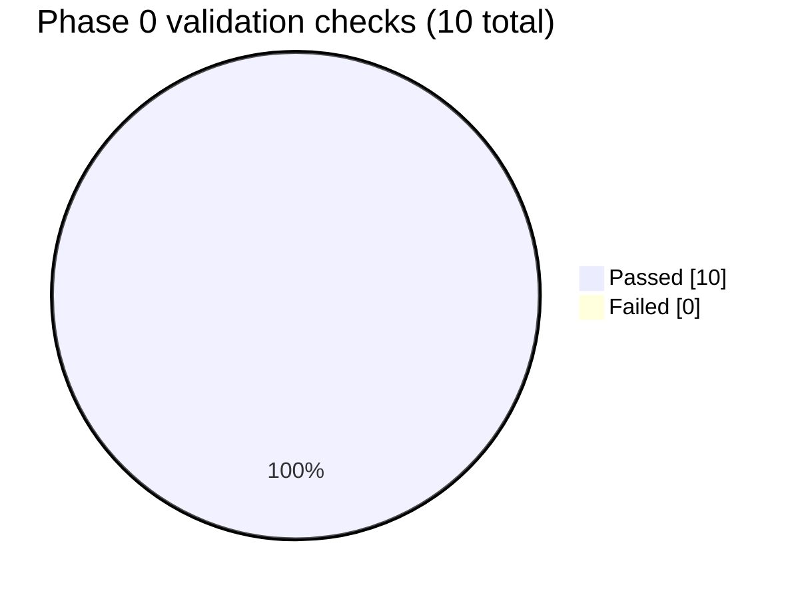

# Phase 0 — Derisk the AI prompt: Test Report

**Phase:** 0 — Derisk the Gemini verdict prompt
**Automated test suite:** none yet — `pytest.ini`/`tests/` didn't exist until Phase 1.
**Validation method:** manual, repeated runs of `scripts/test_gemini_prompt.py` (a standalone
script with zero dependency on Postgres/FastAPI) against three fixtures in `scripts/fixtures/`.

This phase existed to answer one question *before* any backend code was written: will
Gemini's free tier actually return a real buy/hold/sell verdict, or will it hedge/refuse like a
consumer chatbot? Since the whole AI pipeline (Phase 4) depends on the answer, "tests" here
means validation checks against a running script, not pytest assertions.

## Build checklist (spec.md T0.1–T0.7)

| ID | Check | Result |
|---|---|---|
| T0.1 | Draft `verdict_prompt_v1.md` (private single-user framing, grounding constraint, schema-forced JSON) | ✅ Done |
| T0.2 | Build standalone `scripts/test_gemini_prompt.py` (zero dependency on backend/DB) | ✅ Done |
| T0.3 | Validate against normal + thin synthetic fixtures | ✅ Done |
| T0.4 | Extend schema with `price_targets` + `hold_period_days` | ✅ Done |
| T0.5 | Build `verdict_critique_prompt_v1.md` adversarial second-opinion pass + `--critique` flag | ✅ Done |
| T0.6 | Validate both prompts against real researched data (AAPL, 2026-08-02 snapshot) | ✅ Done |
| T0.7 | Secure API key handling: `.env` + `.gitignore` + `.env.example` | ✅ Done |

## Behavioral validation checks

These are the actual pass/fail criteria that mattered — the thing Phase 0 existed to prove or
disprove:

| # | Check | Fixture(s) used | Result |
|---|---|---|---|
| 1 | Verdicts actually vary — not always "hold" across repeated runs | `sample_wiki_data.json` (normal), repeated `--repeat 5` | ✅ Pass |
| 2 | Confidence tracks data quality | `sample_wiki_data.json` vs `sample_wiki_thin.json` | ✅ Pass |
| 3 | Thin/contradictory data produces an honest low-confidence "hold", not a refusal or false confidence | `sample_wiki_thin.json` | ✅ Pass |
| 4 | Price targets are internally consistent and anchored to real swing levels | `aapl_live.json` (real researched data) | ✅ Pass |
| 5 | Adversarial critique produces genuine pushback, not a rubber-stamped agreement | `aapl_live.json` with `--critique` | ✅ Pass |

**10/10 checks passed. 0 failed. Nothing needed fixing** — the prompt framing worked on the
first design, so Phase 0 closed without a derisking iteration loop.

## Why no pytest here

Phase 0's job was to falsify an assumption as cheaply as possible *before* committing to
building `ai_service`, the DB schema, etc. around it. A live LLM call is non-deterministic and
costs real quota, so it isn't something to assert on in an automated suite the same way a
parser or a DB upsert is — repeated manual runs with a human judging "is this a genuine
verdict, not a hedge" was the right tool for this specific question. Phase 1 introduces the
first real pytest suite once there's actual code (a Finnhub client, an HTTP endpoint) to unit
test.

**Next:** [phase-1.md](phase-1.md)
