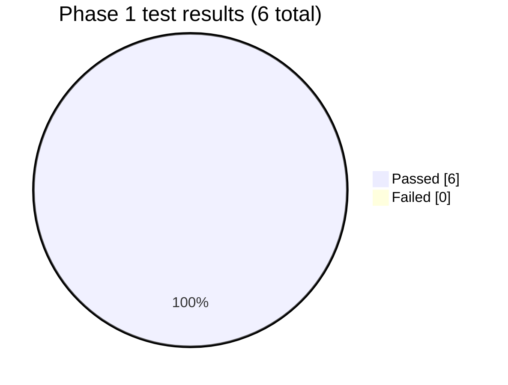

# Phase 1 — Backend skeleton: Test Report

**Phase:** 1 — Backend skeleton
**Suite introduced:** `pytest.ini`, `tests/unit/`, `tests/integration/` (this is the first
automated test suite in the project).
**Result at phase close:** **6 / 6 passed, 0 failed.**

## What was tested

| File | Tests | What it covers |
|---|---|---|
| `tests/unit/test_health.py` | 1 | `GET /health` returns `200 {"status": "ok"}` |
| `tests/unit/test_finnhub_client.py` | 5 | `FinnhubClient` against recorded fixtures via `respx` — no live network |

### `test_finnhub_client.py` (original Phase 1 version)

| Test | Behavior asserted |
|---|---|
| `test_get_profile_returns_parsed_data` | A successful profile response is parsed and returns the expected fields |
| `test_get_profile_empty_response_raises` | An empty profile body (Finnhub's signal for an invalid ticker) raises `ProviderError` |
| `test_get_quote_rate_limit_raises_provider_error` | HTTP 429 raises `ProviderError` |
| `test_get_quote_missing_price_raises` | A quote with `c: null` raises `ProviderError` |
| `test_missing_api_key_raises_immediately` | Constructing the client with an empty API key fails fast, before any network call |

At this point there was only one, flat `ProviderError` — the transient/permanent split
(`TransientProviderError`/`PermanentProviderError`) didn't exist yet; that's a Phase 3 addition
(see [phase-3.md](phase-3.md)).

## Manual end-to-end verification

Beyond pytest, Phase 1's exit criterion (per spec.md) was checked by hand against a real,
locally running Postgres + FastAPI:

| Check | Result |
|---|---|
| `GET /health` → 200 | ✅ Pass |
| `alembic upgrade head` creates `companies`/`price_bars` cleanly | ✅ Pass |
| `GET /companies/AAPL/wiki` → 200 with real Finnhub data, persisted correctly (confirmed via direct query) | ✅ Pass |

## What got fixed

Nothing failed during Phase 1 itself, but a real environment issue was diagnosed and
worked around: Docker Desktop's (and separately Podman's) host↔container port-forwarding
failed to deliver TCP traffic from the Windows host to a containerized Postgres on this
machine — proven to be host-level interference (likely the corporate-managed endpoint security
agent), not a bug in either container runtime. **Fix:** PostgreSQL installed natively inside the
`Ubuntu` WSL distro, with a matching `.venv-wsl` Python virtualenv also inside WSL, so the app
and database run in the same Linux VM and nothing crosses the Windows host boundary where the
interference occurs. `docker-compose.yml` is kept as-is for any future machine where Docker's
port-forwarding works normally.

**Previous:** [phase-0.md](phase-0.md) · **Next:** [phase-2.md](phase-2.md)
