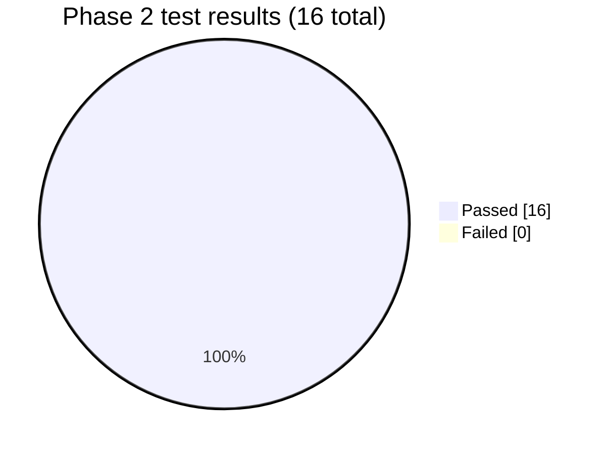
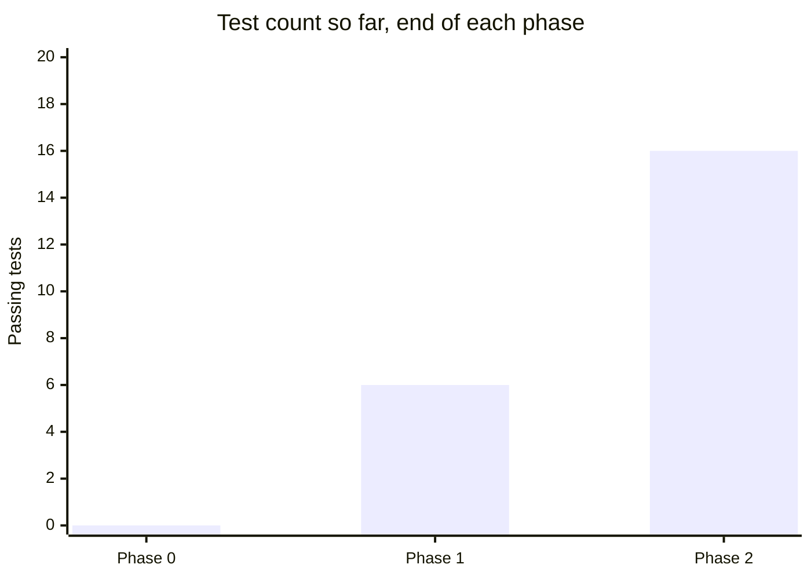

# Phase 2 — Wiki assembly + lookup tier: Test Report

**Phase:** 2 — Wiki assembly + lookup tier
**Result at phase close:** **16 / 16 passed, 0 failed** (10 new tests added on top of Phase 1's 6).

## What got fixed before any new code was written

Before Phase 2 work could even start, the dev database turned out to be unreachable: `.env`
and `app/config.py` both pointed `DATABASE_URL` at port `5432`, but `pg_lsclusters` inside the
WSL `Ubuntu` distro showed the real Postgres cluster listening on port **5433** (a detail that
had drifted since Phase 1's original verification). `alembic upgrade head` against `5433`
succeeded cleanly once corrected. Fixed in `.env`, `.env.example`, and `app/config.py`'s default
— this was a config drift bug, not a code bug, but it blocked all further work until caught.

## New tests by file

| File | Tests | What it covers |
|---|---|---|
| `tests/unit/test_wiki_sections_service.py` | 5 | Template rendering — pure functions, no DB |
| `tests/integration/test_wiki_service.py` | 2 | `assemble(ticker)` against real Postgres |
| `tests/integration/test_lookup_service.py` | 3 | `get_or_fetch(ticker)` freshness/staleness against real Postgres + mocked Finnhub |

### `test_wiki_sections_service.py`

| Test | Behavior asserted |
|---|---|
| `test_render_overview_thin_data_is_honest` | No profile data yet → honest "not yet available" text, not a fabricated summary |
| `test_render_overview_full_data` | Full profile data renders name/exchange/sector/market cap correctly |
| `test_render_key_metrics_no_data` | No price data yet → explicit "no data" message |
| `test_render_key_metrics_with_bar` | Price bar present → close/day-range/market-cap/sector rendered |
| `test_render_sections_includes_not_yet_ingested_placeholders` | All 5 `WikiSectionKey` values are always present, even before financials/news exist |

### `test_wiki_service.py`

| Test | Behavior asserted |
|---|---|
| `test_assemble_returns_none_for_unknown_ticker` | Unknown ticker → `None`, not an exception |
| `test_assemble_reads_company_bar_and_sections` | Company + latest price bar + wiki sections all correctly assembled into one dict |

### `test_lookup_service.py`

| Test | Behavior asserted |
|---|---|
| `test_get_or_fetch_fetches_and_persists_new_ticker` | A brand-new ticker triggers exactly one fetch, persists as `coverage_tier=lookup` |
| `test_get_or_fetch_serves_fresh_row_without_refetching` | A second call within the freshness window makes zero new provider calls |
| `test_get_or_fetch_refetches_when_stale` | Once `last_profile_refresh_at` is old enough, a new fetch is triggered |

*(Phase 0 shows 0 because it had no pytest suite — see [phase-0.md](phase-0.md) for how that
phase was actually validated.)*

## Manual end-to-end verification

Beyond pytest, the phase's exit criterion — "look up several arbitrary (non-watchlisted)
tickers end-to-end" — was checked against the real running app + real Postgres + real Finnhub:

| Ticker | Result |
|---|---|
| AAPL | ✅ Real data persisted, `coverage_tier=lookup`, all 5 wiki sections generated |
| MSFT | ✅ Same |
| NVDA | ✅ Same |
| Repeat AAPL request | ✅ Served from Postgres in ~6ms, zero new Finnhub calls (freshness cache working) |

**Previous:** [phase-1.md](phase-1.md) · **Next:** [phase-3.md](phase-3.md)
