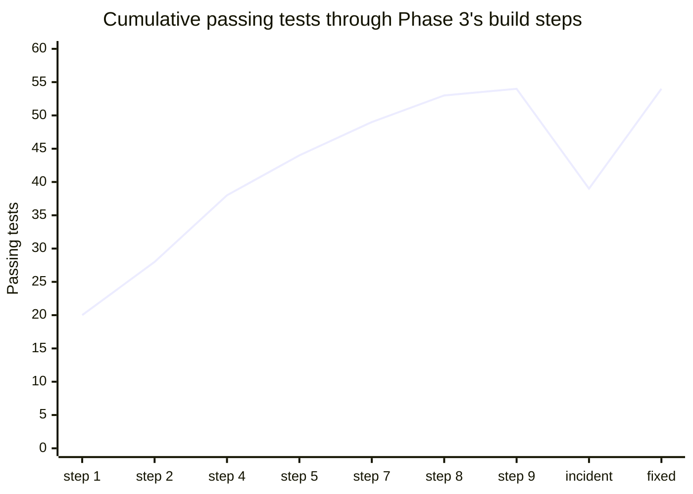
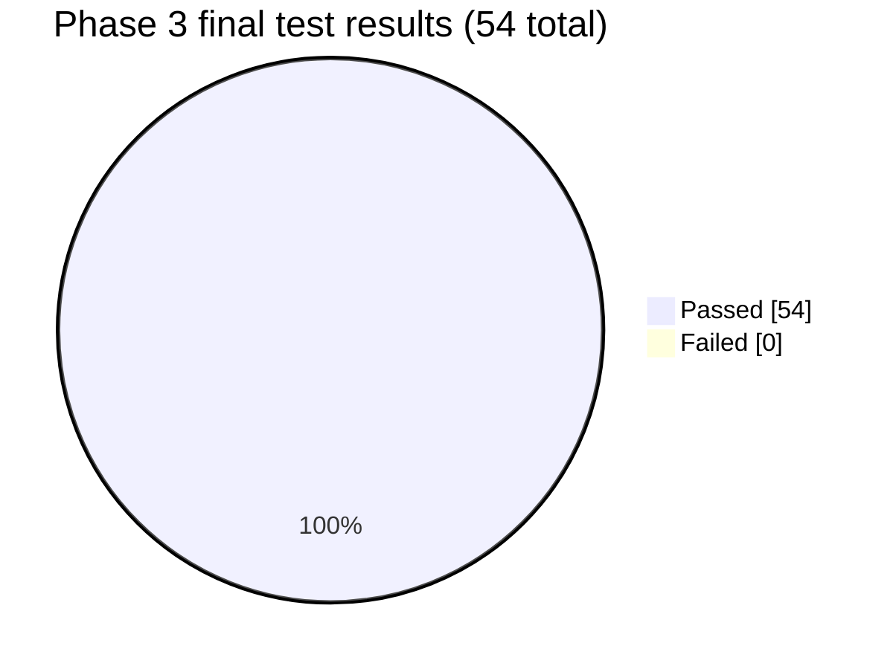
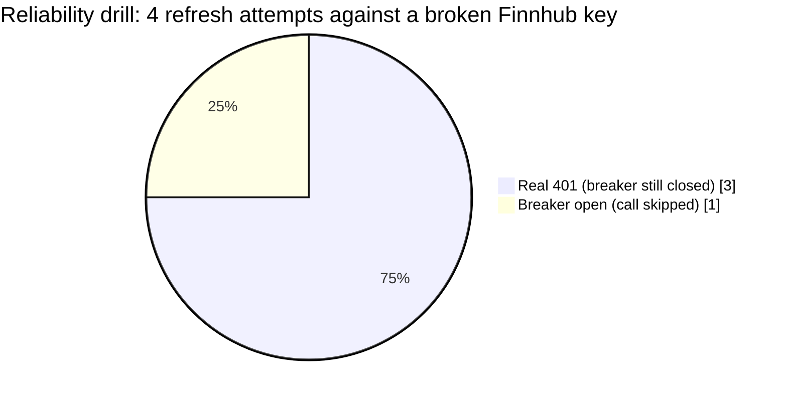
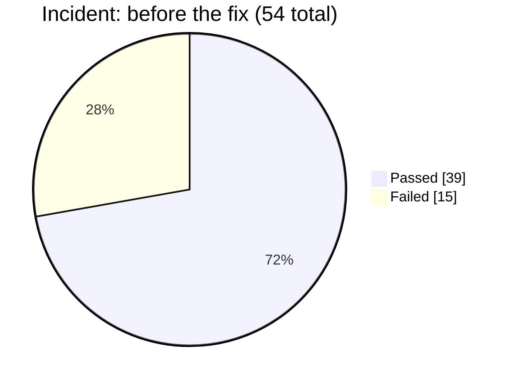
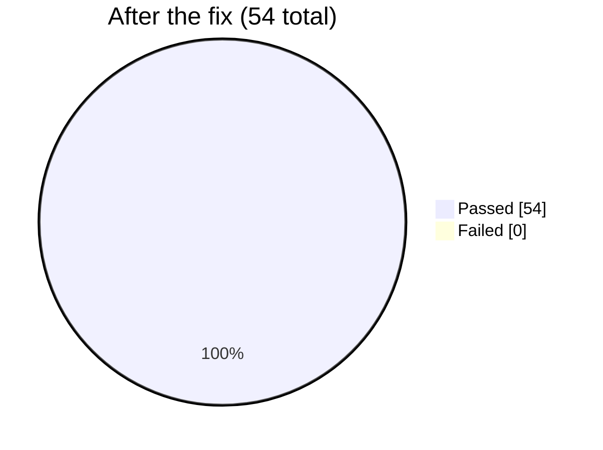

# Phase 3 — Watchlist + scheduler + reliability: Test Report

**Phase:** 3 — Watchlist + scheduler + reliability
**Result at phase close:** **54 / 54 passed, 0 failed** (up from 16 at the end of Phase 2).
**Also produced:** a live reliability drill against the real app, and one real test-isolation
bug found and fixed mid-phase.

## Test count build-up

Phase 3 was built incrementally, running the full suite after every meaningful addition. This
is the actual sequence observed, including the one regression:

| Step | What was added | Suite result |
|---|---|---|
| 1 | Normalized `FinnhubClient` output + typed errors, rewrote its tests | 20 passed |
| 2 | `AlphaVantageClient` + its tests | 28 passed |
| 3 | `watchlist`/`provider_call_log`/`job_runs` models + migration (no new tests) | 28 passed |
| 4 | `rate_limiter.py` + `circuit_breaker.py` + their tests | 38 passed |
| 5 | `provider_orchestrator.py` (`fetch_with_fallback`) + its tests | 44 passed |
| 6 | Wired `lookup_service` through the orchestrator (refactor, no new tests) | 44 passed |
| 7 | `refresh_service.py` + its tests | 49 passed |
| 8 | `watchlist_service.py` + router + its tests | 53 passed |
| 9 | APScheduler + `/internal/refresh` router + its test | 54 passed |
| 10 | **Live reliability drill against the real dev DB** | *(see incident below)* |
| 11 | 15 tests failed — diagnosed as a test-isolation bug, fixed | **54 passed** |



## Per-file test breakdown

| File | Tests | Notes |
|---|---|---|
| `tests/unit/test_finnhub_client.py` | 9 | Rewritten from Phase 1's 5 — normalized output shape, `Transient`/`PermanentProviderError` split, timeout wrapping |
| `tests/unit/test_alpha_vantage_client.py` | 8 | New provider, same normalized shape/error taxonomy, including AV's 200-with-`Note` rate-limit quirk |
| `tests/integration/test_rate_limiter.py` | 5 | Sliding-window budget logic |
| `tests/integration/test_circuit_breaker.py` | 5 | closed/open/half-open transitions |
| `tests/integration/test_provider_orchestrator.py` | 6 | `fetch_with_fallback` — healthy path, permanent-error fallback, transient-retry-then-fallback, circuit-open skip, rate-limit skip, all-providers-fail |
| `tests/integration/test_refresh_service.py` | 5 | Due/not-due logic, inactive entries skipped, provider failure recorded without crashing |
| `tests/integration/test_watchlist_service.py` | 4 | promote/remove, idempotency, safe no-op on unknown ticker |
| `tests/integration/test_refresh_router.py` | 1 | `POST /internal/refresh` response shape |
| carried over from Phase 2 | 16 | unchanged |

9 + 8 + 5 + 5 + 6 + 5 + 4 + 1 + 16 = **54**



## Live reliability drill (not pytest — the real running app)

Phase 3's actual exit criterion (per spec.md) required more than unit tests: *"point Finnhub
client at an invalid key/URL, confirm circuit breaker trips, Alpha Vantage fallback kicks in,
`job_runs` surface the failure, no crashed refresh cycle."* This was run against the real
FastAPI app + real Postgres, not mocks:

1. Started the app with valid credentials, promoted `IBM` to the watchlist (real Finnhub call).
2. Forced its watchlist entry to be "due" via a direct SQL update.
3. Restarted the app with `FINNHUB_API_KEY` set to an invalid value.
4. Hit `POST /internal/refresh` four times in a row.

| Attempt | Result | `job_runs.error_message` |
|---|---|---|
| 1 | Real Finnhub 401, logged, no crash | `finnhub: Finnhub authentication failed -- check FINNHUB_API_KEY` |
| 2 | Same | Same |
| 3 | Same (3rd consecutive failure — `circuit_breaker_failure_threshold`) | Same |
| 4 | **Circuit breaker open** — Finnhub skipped entirely, no network call made | `finnhub: circuit open` |



The server never crashed across any attempt, and drill artifacts (the `IBM` watchlist entry,
`provider_call_log`/`job_runs` rows) were cleaned up afterward. The "Alpha Vantage takes over"
half of the drill was verified via the mocked `test_provider_orchestrator.py` tests instead of
live traffic, since no real `ALPHA_VANTAGE_API_KEY` is configured — get a free key from
alphavantage.co/support/#api-key if you want that leg drilled live too.

## Incident: a real bug found and fixed mid-phase

Immediately after the live drill above, a full suite run returned **15 failed, 39 passed** —
every test touching `circuit_breaker`/`rate_limiter` started failing:

```
FAILED tests/integration/test_circuit_breaker.py::test_closed_when_no_history
FAILED tests/integration/test_circuit_breaker.py::test_closed_when_failures_below_threshold
FAILED tests/integration/test_circuit_breaker.py::test_half_open_after_cooldown_elapses
FAILED tests/integration/test_lookup_service.py::test_get_or_fetch_fetches_and_persists_new_ticker
... (11 more)
```

**Root cause:** `rate_limiter`/`circuit_breaker` read *every already-committed row* in
`provider_call_log`, not just rows written during a given test. The drill's real Finnhub
failures were genuinely committed to the shared dev database, so the next test run saw a
circuit that was, correctly, still open — the code wasn't wrong, the *test isolation* was.
Any future manual/live testing against this same dev database would have silently broken these
tests again.

**Fix:** `tests/integration/conftest.py`'s `db_session` fixture now deletes existing
`provider_call_log` rows *inside* the test's own (rolled-back) transaction before yielding —
this only affects that test's view of the table and is undone by the rollback, so it can never
lose real data, but it guarantees every test starts from a clean provider-call history
regardless of what's been run manually against the same database.





Re-ran the full suite twice consecutively after the fix to confirm the flakiness was actually
gone, not just coincidentally green once: both runs came back 54/54.

**Previous:** [phase-2.md](phase-2.md) · **Back to index:** [README.md](README.md)
