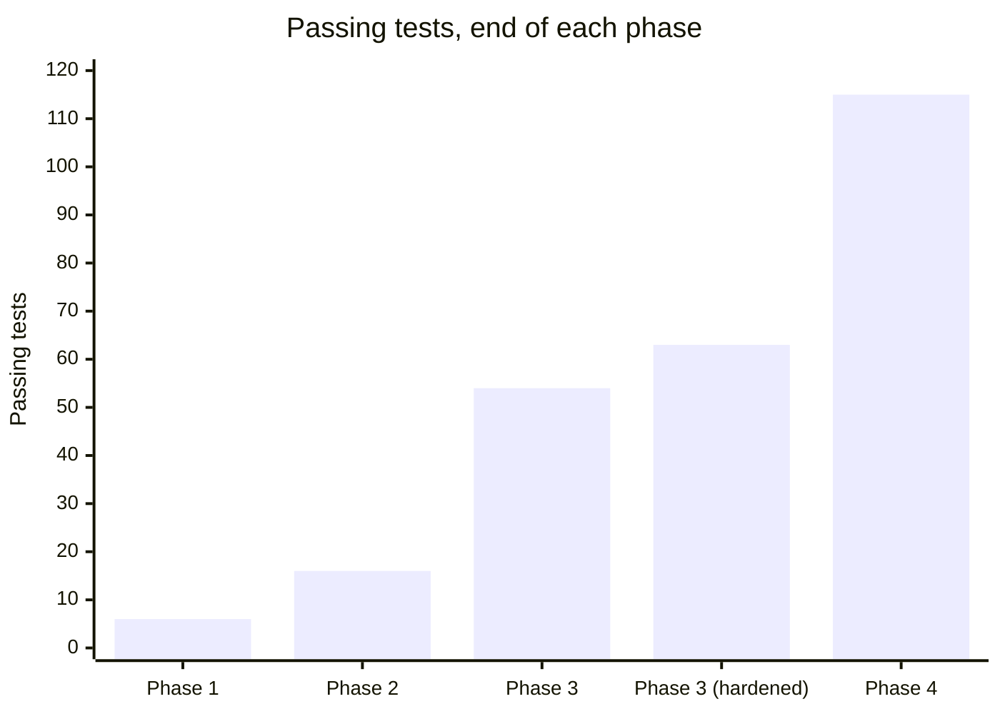
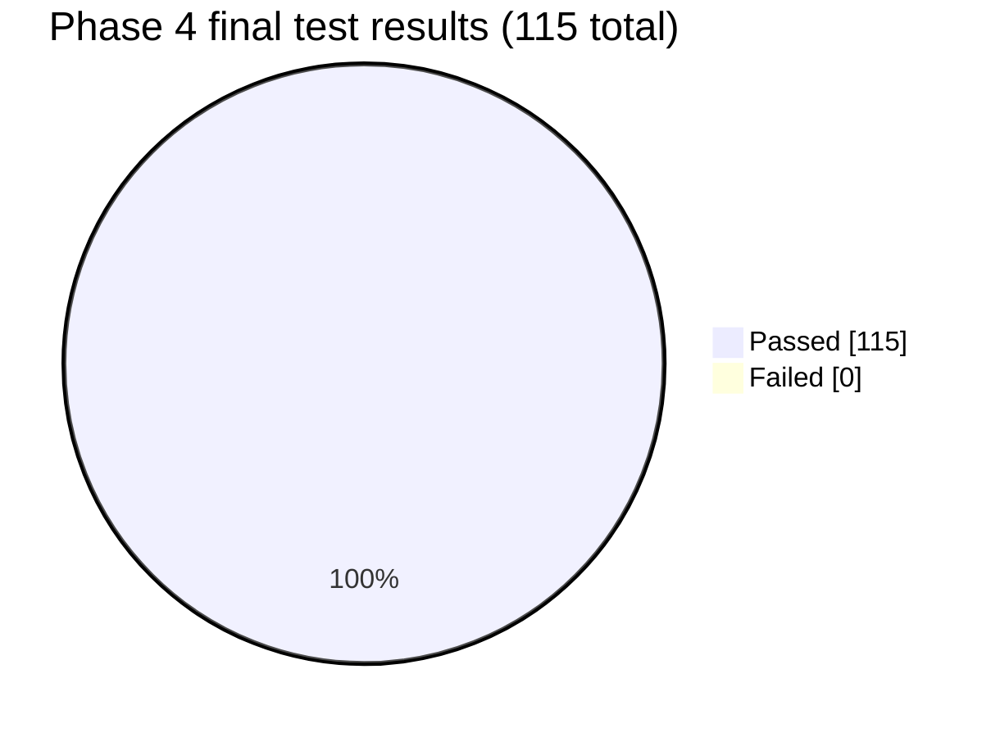
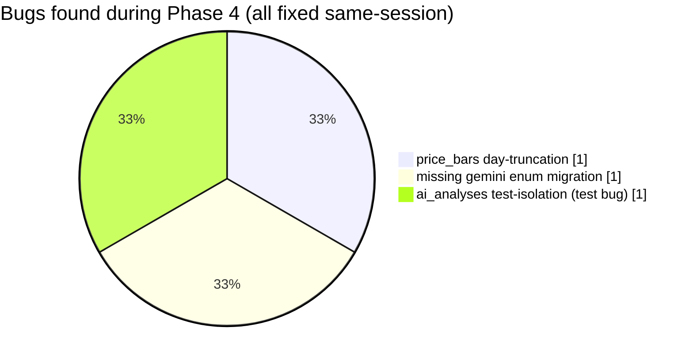

# Phase 4 — AI pipeline (verdict + second opinion): Test Report

**Phase:** 4 — AI pipeline (verdict + second opinion)
**Result at phase close:** **115 / 115 passed, 0 failed** (up from 63 at the end of Phase 3's
post-phase hardening — 52 new tests).
**Also produced:** live verification against the real Gemini API (not mocked), three real bugs
found and fixed mid-phase, and one deliberate scope decision (news + computed technicals, not
fundamentals) made before implementation started.

## Scope decision made before writing any code

Phase 0's `verdict_prompt_v1.md` was validated against rich synthetic fixtures (real
fundamentals, news, computed technicals), but the pipeline through Phase 3 only ever collected
a bare profile + a single latest price bar. Rather than silently feeding Gemini mostly-empty
fields, the choice — confirmed with the user before starting — was to add **real news
ingestion** and **computed technicals** now, and leave **fundamentals** (P/E, revenue growth,
margins) for a future phase, since Gemini already proved (Phase 0's thin fixture) that it
handles an empty `financials_summary_last_4_periods` array honestly rather than fabricating
numbers. The live verification below reconfirms that with real data, not just a fixture.

## Test count build-up

| Addition | Tests | File |
|---|---|---|
| `FinnhubClient.get_news()` | +2 | `tests/unit/test_finnhub_client.py` (9 → 11) |
| `AlphaVantageClient.get_news()` | +3 | `tests/unit/test_alpha_vantage_client.py` (8 → 11) |
| `technicals_service` (swing levels, price summary) | +7 (new file) | `tests/unit/test_technicals_service.py` |
| `ai_service.wiki_to_prompt_data()` mapping | +2 (new file) | `tests/unit/test_ai_service.py` |
| `gemini_client.GeminiClient` | +6 (new file) | `tests/unit/test_gemini_client.py` |
| Real news digest + technicals in `key_metrics` | +4 | `tests/unit/test_wiki_sections_service.py` (5 → 9) |
| `fetch_news_best_effort()` orchestration | +4 | `tests/integration/test_provider_orchestrator.py` (6 → 10) |
| News persisted via `lookup_service` | +1 | `tests/integration/test_lookup_service.py` (3 → 4) |
| News persisted via `refresh_service` | +1 | `tests/integration/test_refresh_service.py` (5 → 6) |
| `build_prompt()`/`build_critique_prompt()` end-to-end | +4 (new file) | `tests/integration/test_ai_service_prompts.py` |
| `generate_verdict()` + budget priority | +5 (new file) | `tests/integration/test_ai_service_generate_verdict.py` |
| `generate_critique()` + lowest-priority budget | +4 (new file) | `tests/integration/test_ai_service_critique.py` |
| `analyze_scheduled()` (skip-on-quota, inactive-ignored) | +3 (new file) | `tests/integration/test_ai_service_analyze_scheduled.py` |
| HTTP-level `/analyze`, `/analyze-scheduled`, `/critique` | +6 (new file) | `tests/integration/test_analysis_router.py` |

2+3+7+2+6+4+4+1+1+4+5+4+3+6 = **52 new tests**, 63 → 115.





## Live verification against the real Gemini API (not mocked)

Unlike every other phase's reliability drill, this one used the real `GEMINI_API_KEY` already
in `.env` — not respx/mocks — since the actual question was "does the real model behave the
way Phase 0 validated," not "does our code call an API correctly."

1. Promoted NVDA to the watchlist (real Finnhub data).
2. `POST /companies/NVDA/analyze` — real Gemini call.
3. `POST /companies/NVDA/critique?analysis_id=<id>` — real Gemini call.
4. `POST /companies/AAPL/critique?analysis_id=1` (AAPL is lookup-tier) — confirm the
   watchlist-only restriction holds against real data, not just a test fixture.

| Check | Result |
|---|---|
| Real verdict returned, schema-valid JSON | ✅ `verdict: hold`, `confidence: 0.25` |
| Honest low confidence + null price targets on thin real data (no financials, no news) | ✅ Matches Phase 0's thin-fixture behavior exactly |
| `reasoning` explicitly names the missing data as the reason, doesn't fabricate | ✅ "zero financial summary periods, news items, or trend metrics" |
| `context_snapshot` in the DB matches the wiki page shown | ✅ `last_close: 200.75` in both |
| Critique agrees with direction but finds a genuine, specific weakness | ✅ Flagged the missing stop-loss, proposed `194.95` anchored to the real 20-day low |
| Critique is not a rubber-stamp | ✅ Real, actionable pushback — not "markets can be volatile" |
| Watchlist-only restriction holds against real lookup-tier data | ✅ AAPL critique → `400` |
| Both real calls logged to `provider_call_log` | ✅ 2 `gemini`/`success` rows, well within the 100/day budget |

Budget-priority ordering (scheduled > on-demand > critique) was **not** verified live — that
would require deliberately exhausting a chunk of the real daily quota with no benefit beyond
what the mocked tests already prove deterministically
(`test_on_demand_blocked_before_full_budget_exhausted_but_scheduled_still_allowed`,
`test_generate_critique_respects_lowest_priority_budget`). Verified there instead.

Also surfaced a real-world provider limitation: Finnhub's free tier rejected the
`/company-news` call for NVDA (logged as a `failure` in `provider_call_log`), and the
best-effort design handled it exactly as intended — the primary profile/quote refresh
succeeded regardless, `recent_news` was just empty. Good confirmation that "news must never
block the primary pipeline" isn't just a nice docstring, it's what actually happened on the
first live call.

Watchlist entry cleaned up afterward (matching Phase 3's drill precedent); the real
`ai_analyses`/`ai_critiques` rows from NVDA were kept, since they're genuine, correct output —
not test pollution.

## Bugs found and fixed mid-phase

### 1. `price_bars.ts` truncated to the hour, not the day
Found while planning (before writing any Phase 4 code): `ingest_service.upsert_profile_and_quote`
truncated a `"1d"`-interval bar's timestamp to the hour, so intraday refreshes fragmented into
multiple rows per day instead of upserting one row per trading day — would have silently broken
every swing-level/price-history computation this phase needed. Fixed first, before building
`technicals_service`.

### 2. Missing enum migration for the Gemini provider
Added `ProviderName.gemini` to the Python enum but forgot the matching Postgres migration.
First rate-limiter check against Gemini failed immediately:

```
psycopg2.errors.InvalidTextRepresentation: invalid input value for enum providername: "gemini"
```

Caught by the test suite on the very first `generate_verdict` test run. Fixed with migration
`0006_add_gemini_provider.py` (`ALTER TYPE providername ADD VALUE 'gemini'`).

### 3. Test-isolation gap on `ai_analyses` (same class of bug as Phase 3, different fix)
The live NVDA verification above committed real `ai_analyses` rows to the shared dev database.
Immediately after, two tests broke:

```
FAILED test_analyze_scheduled_analyzes_every_active_ticker - assert 3 == 2
FAILED test_generate_verdict_provider_error_propagates_and_logs_failure - assert 1 == 0
```

Both asserted a **global** `AiAnalysis` table count instead of scoping to the company they
seeded — a latent bug in the tests themselves, not a repeat of Phase 3's fixture gap (rate
limiting is inherently provider-wide, so clearing `provider_call_log` in the fixture was
correct there; `ai_analyses` is inherently per-company, so the right fix here was scoping the
assertions, not broadening the fixture to blindly wipe a business-data table on every test).
Fixed by filtering both counts to their own seeded `company_id`(s). Re-ran the full suite twice
consecutively afterward — both 115/115.



**Previous:** [phase-3.md](phase-3.md) · **Back to index:** [README.md](README.md)
