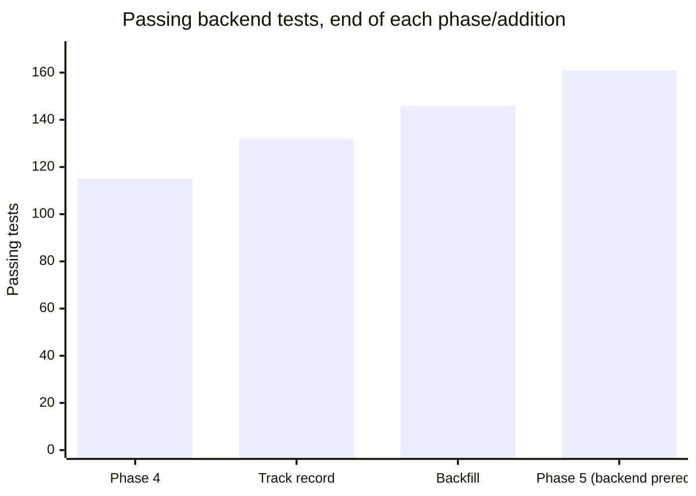
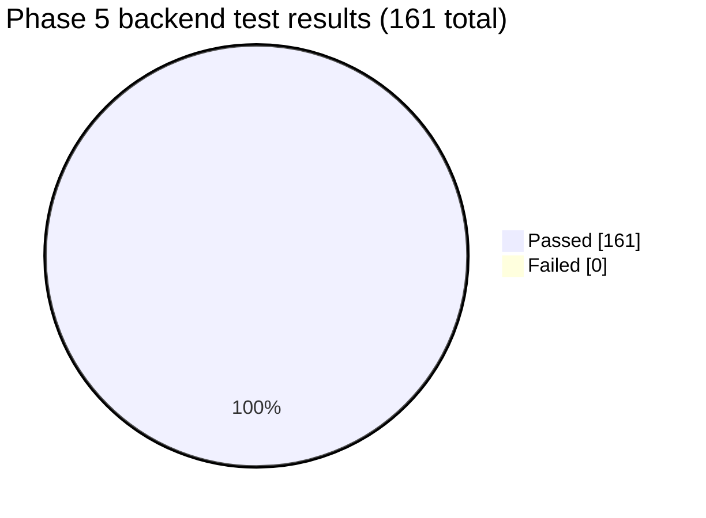
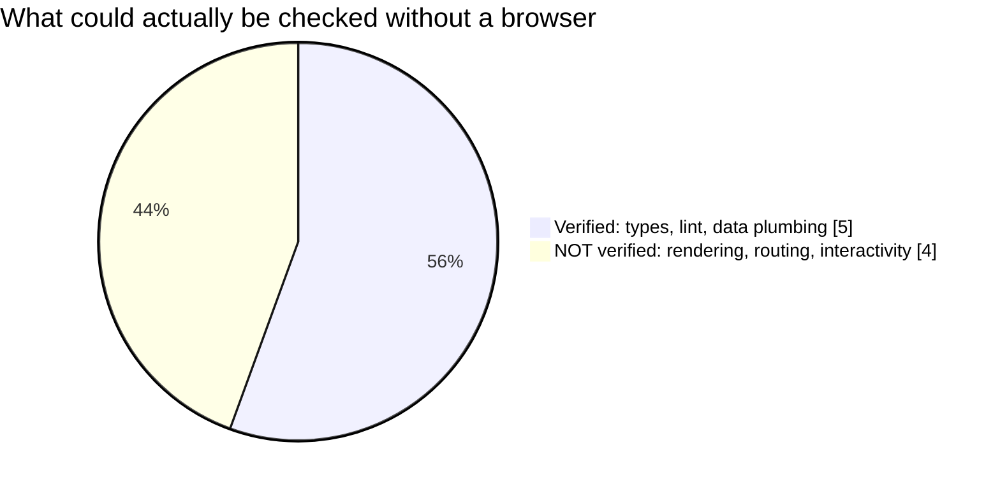

# Phase 5 — Frontend core: Test Report

**Phase:** 5 — Frontend core
**Backend result:** **161 / 161 pytest passed, 0 failed** (up from 146 — 15 new tests, for the
three backend endpoints this phase discovered were missing).
**Frontend result:** no automated test suite (none was in this phase's scope) — verified via
TypeScript compilation, linting, and live HTTP-level proxy checks instead. **Full visual/
interactive verification in a real browser was not possible in this session** — see below.

## Backend prerequisites discovered missing while starting this phase

Starting the frontend build immediately surfaced three gaps — routes the frontend needed that
either never existed or were speced years ago in this file's own API contract table and never
actually built:

| Endpoint | Why it was needed | Tests |
|---|---|---|
| `GET /watchlist` | Dashboard needed a way to list tracked tickers — no endpoint existed at all | +5 (`test_watchlist_service.py` +3, `test_watchlist_router.py` +2) |
| `GET /companies/search?q=` | `/search` route needed real results — speced in §7 since the start, never implemented in Phases 1-4 | +8 (`test_finnhub_client.py` +2, `test_provider_orchestrator.py` +4, `test_search_router.py` +2 new file) |
| `GET /companies/{ticker}/analyses` | The verdict banner and "AI Analysis History" section both need history; `POST /analyze` only ever returned the one verdict it had just created | +2 (`test_analysis_router.py`) |

5 + 8 + 2 = **15 new backend tests**, 146 → 161.

Live-verified before building the search endpoint, per this project's established habit:
Finnhub's `/search` endpoint really is accessible free-tier (confirmed with a real call before
writing `FinnhubClient.search_symbols()`), matching the assumption this time rather than
overturning it (unlike the Alpha Vantage `outputsize=full` surprise two additions ago).

## Frontend: what "tested" means for this phase

Vite + React + TypeScript + Tailwind v4, React Router, React Query. No Vitest/React Testing
Library was set up — not part of T5.1-T5.6's scope, and would be premature before the
upcoming dedicated visual design pass might reshape a lot of this UI anyway. Verification
instead:

| Check | Result |
|---|---|
| `tsc -b --noEmit` (full project type-check) | ✅ Clean, zero errors |
| `oxlint` (linter) | ✅ 0 errors, 2 harmless "fast-refresh" style warnings on `AuthContext.tsx` (mixes a component export with hook/helper exports — a very common, accepted React pattern) |
| Both dev servers start and stay up | ✅ (`uvicorn` on :8000, `vite` on :5173) |
| SPA shell serves with the correct title | ✅ |
| Vite dev proxy (`/api/*` → real backend) reaches real data | ✅ `/api/watchlist`, `/api/companies/AAPL/wiki`, `/api/companies/search?q=apple`, `/api/companies/AAPL/analyses` all returned real backend JSON through the proxy |

## Honest limitation: no browser was available

This session runs as a background job with no interactive Chrome attached —
`claude-in-chrome` was unavailable (checked via `ToolSearch`, no matching tools returned).
That means the checks above prove the code compiles, lints cleanly, and every API call the
frontend makes resolves against real backend data — **not** that the UI actually renders
correctly, that client-side routing/the auth redirect behave as coded, that buttons and forms
work, or that the responsive layout holds up. Those require actually looking at it.

Per the project's own standing instruction ("for UI or frontend changes... if you can't test
the UI, say so explicitly rather than claiming success") — saying so explicitly: **open
`http://localhost:5173` yourself before trusting this beyond "the code compiles and the API
calls resolve."** Both dev servers were left running (not stopped, unlike every other phase's
backend-only drills) specifically so this is immediately checkable.

## Known environment friction

Vite's dependency pre-bundling logged one `EACCES: permission denied` error on a rename
inside `node_modules/.vite/deps` on first start, then recovered and served correctly on every
subsequent request. Almost certainly the same class of issue as Phase 1's Docker/Podman
networking note — OneDrive's file-sync locking interfering with a path that crosses the
Windows/WSL boundary. Not blocking, but worth knowing about if the dev server ever seems stuck
on a fresh `npm run dev`.

**Previous:** [historical-backfill.md](historical-backfill.md) · **Back to index:** [README.md](README.md)
