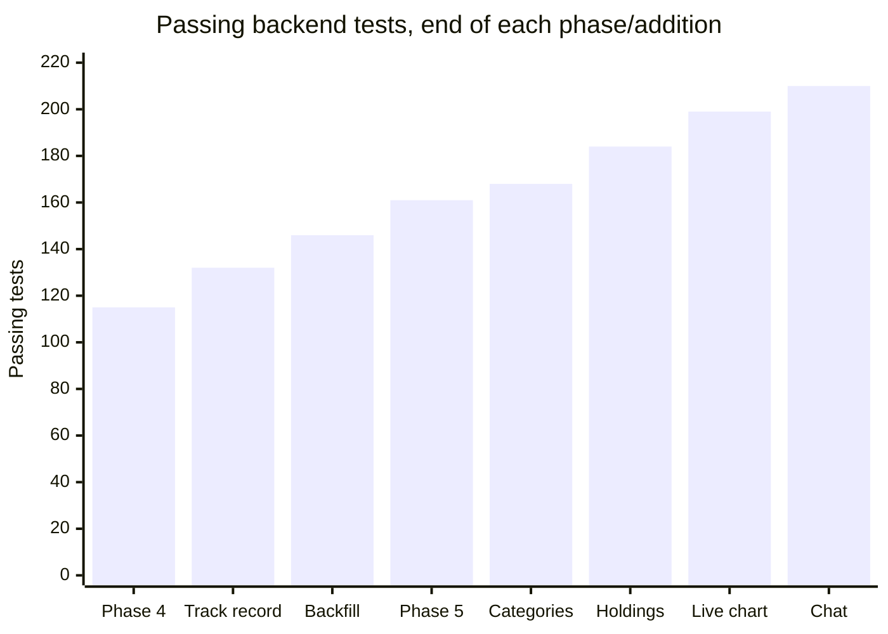

# Post-Phase-5 Additions — Categories, Holdings, Live Chart, Chat: Test Report

**Scope:** four features requested before the planned visual design pass, built in the user's
explicitly chosen order: **Categories → Holdings → Live Chart → Chat**.
**Backend result:** **210 / 210 pytest passed, 0 failed** (up from 161 at Phase 5 close — 49
new tests across the four features).
**Frontend result:** no automated test suite (same as Phase 5) — verified via TypeScript
compilation/build and live HTTP-level checks against the real running backend. **Full visual/
interactive verification in a real browser was still not possible this session** — same
limitation as Phase 5, see [phase-5.md](phase-5.md#honest-limitation-no-browser-was-available).

## 1. Categories

Sector-to-category taxonomy (`app/services/sector_taxonomy.py`) — keyword-matched, ordered
mapping of Finnhub's granular `finnhubIndustry` values down to ~11 broad categories, falling
back to `"Other"` for anything unmapped rather than guessing. Wired into
`wiki_service.assemble()` and `watchlist_service.list_watchlist()` as an additive `category`
field (the granular `sector` field is untouched). Frontend: category filter chips on the
dashboard (client-side filter, no new endpoint), a category badge on the wiki page infobox.

**Tests:** `test_sector_taxonomy.py` (+7) — 161 → 168.

## 2. Holdings

Personal position tracking, scoped narrowly per the user's explicit decision: shares + cost
basis per share only — no tax lots, no realized-gains accounting, no cross-brokerage import.
One `holdings` row per company (`app/db/models.py::Holding`, migration `0008`).
`holdings_service.upsert()` auto-promotes a ticker to the watchlist the first time a position
is added (not on every edit, to avoid re-triggering a live provider fetch each time). AI
position-awareness: a new `verdict_prompt_v2.md` adds a "Your Position" section, honestly
stating "no position" when none exists — this became the new default prompt for every verdict,
not just held tickers. Frontend: `/portfolio` route (add/edit/remove + totals), a "Your
Position" panel on the wiki page.

**Notable implementation detail:** `holdings_service.py` imports `lookup_service`/
`watchlist_service` lazily (inside `upsert()`, not at module level) — `wiki_service` needed to
import `holdings_service` at module level to expose `holding` on every wiki response, but
`wiki_service` is itself imported by both of those modules, so a module-level import would have
created a circular import. Verified with `python -c "import app.main"` after wiring it up.

**Tests:** `test_holdings_service.py` (+9), `test_holdings_router.py` (+5),
`test_ai_service.py` unit tests (+2, position-text formatting) — 168 → 184.

## 3. Live Chart

Confirmed live, before writing any code, that Finnhub's free tier does **not** grant access to
`/stock/candle` (a real call returned `{"error":"You don't have access to this resource."}`) —
so "near-live" here means aggregating repeated `/quote` polls into a new `"5m"` `price_bars`
interval server-side (`ingest_service.record_live_quote`), rather than a restricted/paid
candle endpoint. `GET /companies/{ticker}/price-history` serves historical daily bars for
chart context; `POST /companies/{ticker}/live-quote` is called by the frontend every ~20s
**only while a company page is open** (not by a background scheduler), so the quote budget is
only spent while someone is actually watching. Frontend: `lightweight-charts` (v5 API —
`chart.addSeries(CandlestickSeries, ...)`, not v4's `addCandlestickSeries()`), a `PriceChart`
component on `CompanyPage`.

**Tests:** `test_provider_orchestrator.py` (+4, `fetch_quote_best_effort`),
`test_ingest_service.py` (+4, `record_live_quote`/`bars_for_interval`),
`test_live_price_service.py` (+2, new file), `test_price_history_router.py` (+5, new file) —
184 → 199.

**Live-verified** against the real running backend and a real NVDA quote: `POST
/companies/NVDA/live-quote` correctly created a `5m` bar from the live price, retrievable via
`GET /companies/NVDA/price-history?interval=5m`.

## 4. Chat

Grounded AI chat per the user's explicit decision: the assistant may **only** discuss
companies already tracked in this app (any row in `companies` — watchlist, holdings, or a
one-off lookup all create one via `lookup_service.get_or_fetch`), using the exact same
`wiki_service.assemble()` data visible on that company's own wiki page — never Gemini's
general/training knowledge, never a live market-wide scan. New `chat_messages` table (linear,
single-user history, migration `0009`), `chat_prompt_v1.md`, and its own
`gemini_chat_budget_fraction` (0.2) — the lowest-priority consumer of the daily Gemini budget,
so a burst of chat questions can never starve scheduled verdicts, on-demand analysis, or
critiques. Frontend: `/chat` route with a message list + input.

**Tests:** `test_chat_service.py` (+6, new file), `test_chat_router.py` (+5, new file) —
199 → 210.

**Live-verified** against the real running backend with a real Gemini call:
- Asked "what should I do with NVDA?" (a real, currently-tracked watchlist ticker) — the
  reply correctly cited NVDA's real live price ($206.89), real 1-day/1-month price change,
  real 50-day moving average position, and correctly stated no position was held.
- Asked "Should I buy Tesla stock?" (a real company, **not** tracked in this app) — the
  reply correctly refused, named real tracked alternatives instead (AAPL, NVDA, MSFT, AMD,
  IBM — confirming these are genuinely tracked from this project's accumulated history), and
  suggested looking up TSLA first. This is the core safety guarantee this feature is built
  on, and it held.
- Both drill messages were deleted afterward (`chat_messages` has no `DELETE` endpoint since
  it's intentionally append-only, so cleanup was a direct `DELETE FROM chat_messages WHERE
  id IN (...)` against the dev database, scoped to exactly the four rows just created).

## Incident: the same test-isolation bug pattern, twice more, different shapes

This project has now hit this exact class of bug **four times** across its history — real,
previously-committed data in the shared dev Postgres database leaking into tests that assume
an empty/isolated starting state, because Postgres transactions see all already-committed data
regardless of a test's own rolled-back transaction scope. Each time, the fix has depended on
what kind of data leaked:

- **This session, incident 1 (`Watchlist`):** starting work on Categories, the full suite
  failed 8/168 with a real, currently-active `NVDA` watchlist entry appearing in tests
  expecting an empty watchlist (`test_analyze_scheduled_ignores_inactive_entries`,
  `test_list_watchlist_empty`, etc.) — turned out to be genuine, not a leftover drill: the
  user had actually clicked "Add to Watchlist" on the real running frontend left up since
  Phase 5's verification, proving that flow works end-to-end. Since this was real user data
  (not disposable drill data), the fix followed the `provider_call_log` precedent from Phase
  3: `tests/integration/conftest.py`'s `db_session` fixture now also deactivates (not
  deletes) every pre-existing `Watchlist` row inside the test's own rolled-back transaction —
  invisible to every test, restored the moment the transaction rolls back, and the real NVDA
  entry was completely unaffected once the test suite finished. 8 failed → 168 passed, stable
  across two full re-runs.
- **This session, incident 2 (`Company`, during Chat):** two "nothing tracked" chat tests
  failed because chat's grounding intentionally queries *every* `companies` row (not just
  this test's own), and the shared dev database already has many real company rows from this
  project's own live-verification history (AAPL, NVDA, MSFT, AMD, IBM, confirmed by the
  chat's own refusal message above). Unlike `Watchlist`, `companies` has no boolean flag to
  hide behind, and bulk-clearing it in the fixture would risk cascading into every other
  table's foreign keys — so this followed the *other* established precedent instead (Phase
  4's `ai_analyses` fix): don't force the database into an artificial empty state, fix the
  test to not depend on one. Both tests now monkeypatch
  `chat_service._build_grounding_context` directly to return `[]`, testing the
  `NoTrackedCompaniesError` path in real isolation regardless of what's actually in the
  shared database.

The pattern holds across all four incidents: whether the fix is "clear it in the fixture" or
"scope the test's own assertion" depends entirely on whether the leaking table is disposable
bookkeeping/state (`provider_call_log`, `Watchlist` — safe to reset per-test) or genuinely
significant data the test shouldn't assume is absent (`ai_analyses`, `companies` — scope the
test instead). Getting this distinction right is now happening faster each time it comes up.

## Honest limitation, carried forward from Phase 5

Same as Phase 5: no interactive browser was available this session. All four frontend pieces
(category chips, portfolio page, price chart, chat page) compile and build cleanly
(`tsc -b && vite build`, zero errors), and every new/changed API call was verified with real
`curl` requests against the actually-running dev backend — but actual rendering, the
`lightweight-charts` chart drawing correctly, and UI interactivity were **not** visually
checked. Both dev servers remain running for you to check directly.

**Previous:** [phase-5.md](phase-5.md) · **Back to index:** [README.md](README.md)
